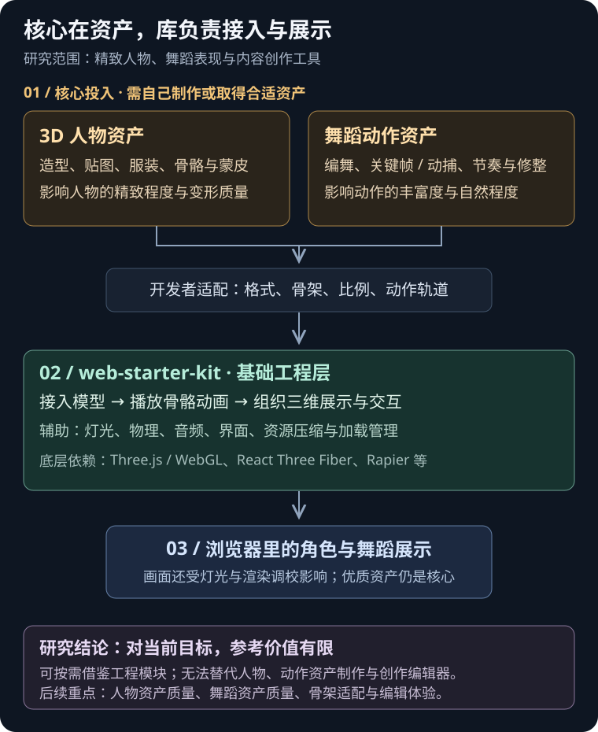
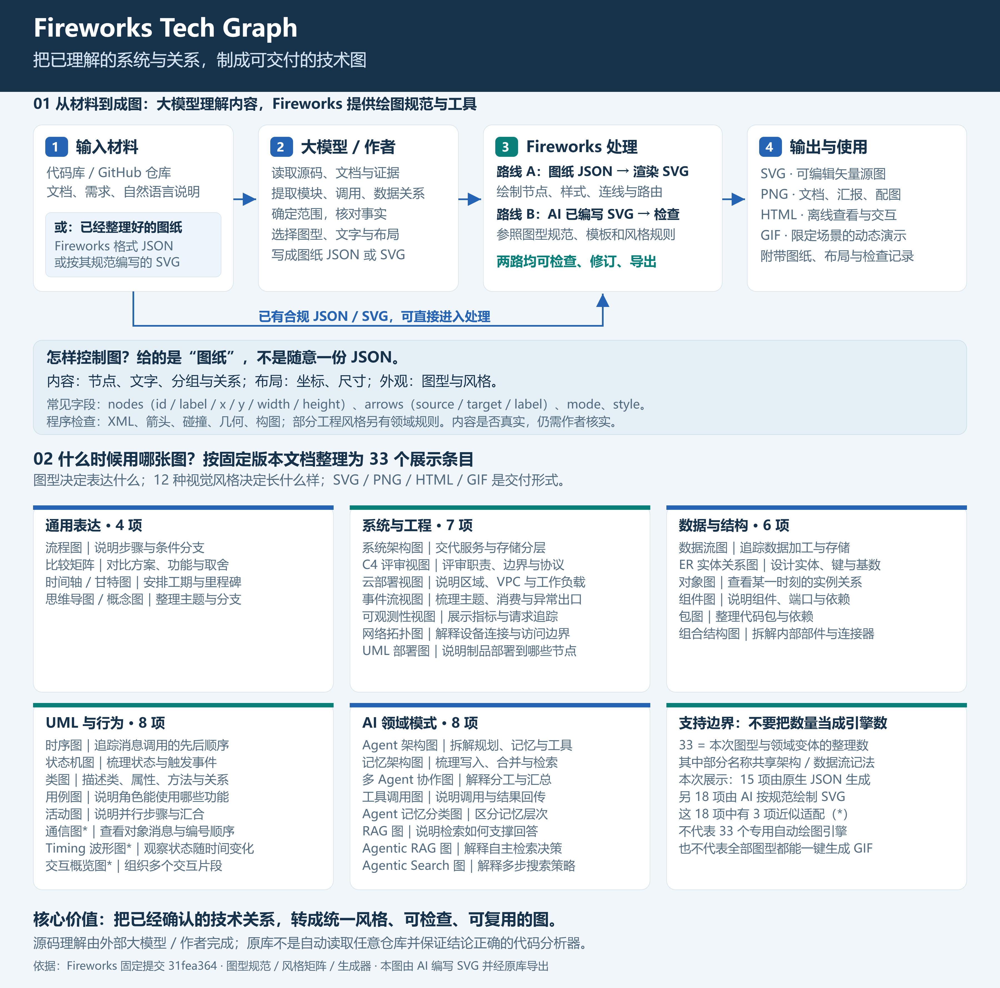
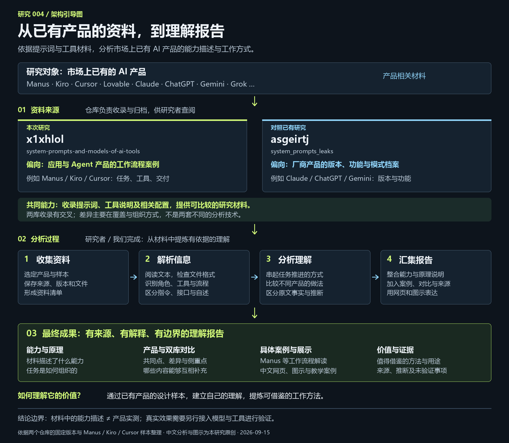
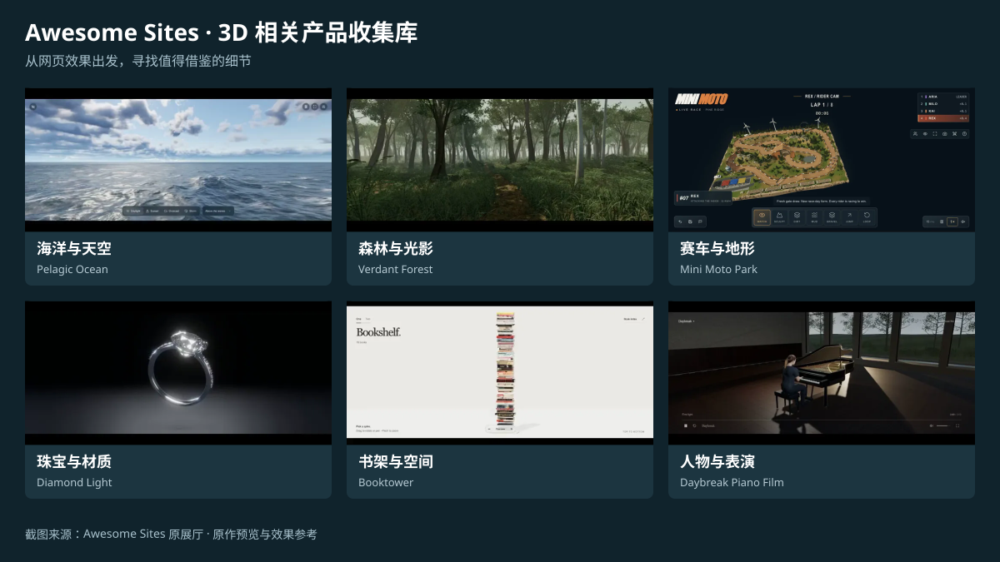

# GitHub 项目研究笔记

记录值得深入研究的开源项目：理解设计、运行验证、动手改造，并沉淀可复用的结论。

这里是研究总仓库。首页只保留项目摘要、顺序索引、预览图和演示入口；源码实验、运行方法和研究笔记收纳在各子项目中。

## 项目索引

按三位数字编号升序排列。编号分配后保持不变，不因完成、暂停或归档而重新编号。

<!-- PROJECT_INDEX:START -->
| 编号 | 项目 | 摘要 | 状态 | 上游 | 演示 |
| --- | --- | --- | --- | --- | --- |
| 001 | [Unique3D：从一张图片到三维网格](projects/001-unique3d/README.md) | 单张物体图片经预训练扩散模型生成多视图与法线，再由 ISOMER 重建、细化并上色，导出 GLB 网格；整理模型与算法分工、效果边界及三维技术路线对比。 | 已总结 | [GitHub](https://github.com/AiuniAI/Unique3D) | [在线演示](https://yydshly.github.io/0915_codex_project/001-unique3d/) |
| 002 | [Web Starter Kit：3D 人物与舞蹈演示、接入能力](projects/002-web-game-starter/README.md) | 提供 3D 人物模型与舞蹈动作的接入、播放和演示。模型与动作资产仍需自行制作或取得并适配；对当前创作目标参考价值有限，核心在人物与动作资产。 | 已总结 | [GitHub](https://github.com/vibegameengine/web-starter-kit) | [在线演示](https://yydshly.github.io/0915_codex_project/002-web-game-starter/) |
| 003 | [Fireworks：技术图生成库、输入与图型全览](projects/003-fireworks-tech-graph/README.md) | 技术图生成与导出库：接收用户或大模型整理的 JSON/SVG，绘制、检查并导出。盘点33个图型与领域条目、12种风格，明确输入要求、使用场景及能力边界。 | 已总结 | [GitHub](https://github.com/yizhiyanhua-ai/fireworks-tech-graph) | [在线演示](https://yydshly.github.io/0915_codex_project/003-fireworks-tech-graph/) |
| 004 | [AI 工具资料库：收集、分析与理解报告](projects/004-ai-tool-prompts/README.md) | 收集 Manus、Kiro、Cursor、Lovable 等 AI 工具的提示词、工具说明与配置资料，供研究者解析、分析并整理成产品理解报告；对我们的实际价值仍需后续研究与验证。 | 已总结 | [GitHub](https://github.com/x1xhlol/system-prompts-and-models-of-ai-tools) | [在线演示](https://yydshly.github.io/0915_codex_project/004-ai-tool-prompts/) |
| 005 | [Awesome Sites：3D 相关产品收集库](projects/005-awesome-sites/README.md) | 收集 80 个以 3D 场景及相关交互产品为主的样例。很多表现方式与已有实践重合，主要保留效果、交互与实现线索参考；尚未确认新增可复用技术能力。 | 已总结 | [网站](https://awesomesites.ai/) | [在线演示](https://yydshly.github.io/0915_codex_project/005-awesome-sites/) |
<!-- PROJECT_INDEX:END -->

## 项目预览

<!-- PROJECT_CARDS:START -->
### 001 · Unique3D：从一张图片到三维网格

单张物体图片经预训练扩散模型生成多视图与法线，再由 ISOMER 重建、细化并上色，导出 GLB 网格；整理模型与算法分工、效果边界及三维技术路线对比。


[研究笔记](projects/001-unique3d/README.md) · [GitHub](https://github.com/AiuniAI/Unique3D) · [在线演示](https://yydshly.github.io/0915_codex_project/001-unique3d/)

状态：已总结 · 标签：图生3D / 扩散模型 / 几何重建 / 研究网页

### 002 · Web Starter Kit：3D 人物与舞蹈演示、接入能力

提供 3D 人物模型与舞蹈动作的接入、播放和演示。模型与动作资产仍需自行制作或取得并适配；对当前创作目标参考价值有限，核心在人物与动作资产。



[研究笔记](projects/002-web-game-starter/README.md) · [GitHub](https://github.com/vibegameengine/web-starter-kit) · [在线演示](https://yydshly.github.io/0915_codex_project/002-web-game-starter/)

状态：已总结 · 标签：Three\.js / 网页游戏 / 交互实验 / 角色动画 / 物理模拟

### 003 · Fireworks：技术图生成库、输入与图型全览

技术图生成与导出库：接收用户或大模型整理的 JSON/SVG，绘制、检查并导出。盘点33个图型与领域条目、12种风格，明确输入要求、使用场景及能力边界。



[研究笔记](projects/003-fireworks-tech-graph/README.md) · [GitHub](https://github.com/yizhiyanhua-ai/fireworks-tech-graph) · [在线演示](https://yydshly.github.io/0915_codex_project/003-fireworks-tech-graph/)

状态：已总结 · 标签：技术绘图 / SVG / Agent Skill / Archify 对照 / Graphify 对照

### 004 · AI 工具资料库：收集、分析与理解报告

收集 Manus、Kiro、Cursor、Lovable 等 AI 工具的提示词、工具说明与配置资料，供研究者解析、分析并整理成产品理解报告；对我们的实际价值仍需后续研究与验证。



[研究笔记](projects/004-ai-tool-prompts/README.md) · [GitHub](https://github.com/x1xhlol/system-prompts-and-models-of-ai-tools) · [在线演示](https://yydshly.github.io/0915_codex_project/004-ai-tool-prompts/)

状态：已总结 · 标签：工具资料收集 / 产品理解报告 / 双库对比 / 价值待研究

### 005 · Awesome Sites：3D 相关产品收集库

收集 80 个以 3D 场景及相关交互产品为主的样例。很多表现方式与已有实践重合，主要保留效果、交互与实现线索参考；尚未确认新增可复用技术能力。



[研究笔记](projects/005-awesome-sites/README.md) · [网站](https://awesomesites.ai/) · [在线演示](https://yydshly.github.io/0915_codex_project/005-awesome-sites/)

状态：已总结 · 标签：3D 相关产品 / 案例收集 / 效果参考 / 交互参考 / 技术增量有限
<!-- PROJECT_CARDS:END -->

## 新增研究项目

需要 Python 3.10 或以上版本，无需安装第三方依赖。在仓库根目录运行：

```sh
python scripts/projects.py new sample-project --title "示例项目" --upstream https://github.com/owner/repo --summary "用一句话说明它解决什么问题，以及为什么值得研究。"
```

命令会自动分配下一个编号、创建研究目录并更新首页。上面的名称与链接仅为使用示例，请替换为实际项目。

1. 完善子项目的 `README.md`，记录上游版本、运行方法和研究结论。
2. 将截图放到子项目的 `assets/`，在 `project.json` 的 `cover` 中填写相对路径，例如 `assets/cover.png`。
3. 修改摘要、状态或演示链接后，运行 `python scripts/projects.py sync` 更新首页。
4. 提交前运行 `python scripts/projects.py check`，检查元数据和首页是否一致。

## 目录导航

| 位置 | 内容 |
| --- | --- |
| [projects/](projects/) | 按编号管理的研究子项目 |
| [templates/project/](templates/project/) | 统一的研究记录和截图模板 |
| [docs/CONVENTIONS.md](docs/CONVENTIONS.md) | 编号、状态、截图与源码管理约定 |
| [docs/WEB_DEMOS.md](docs/WEB_DEMOS.md) | 多个 Web 演示的路径和发布方案 |
| [web/](web/) | 未来统一发布的静态 Web 目录 |
| [scripts/](scripts/) | 新建项目与同步索引工具 |

## 研究方式

**收录 → 阅读 → 复现 → 实验 → 总结**

每个子项目独立管理运行环境和依赖。记录上游仓库、许可证与研究使用的版本；引用或修改第三方代码时保留原有许可与署名。

已收录 Unique3D 研究，完成能力摘要、实现原理、路线对比和网页。引导图已于 2026-09-15 获用户确认，网页已部署至 GitHub Pages，线上页面、图片与交互验证通过。

已总结 Web Starter Kit：提供 3D 人物模型与舞蹈动作的接入、播放和演示。模型与动作资产仍需自行制作或取得并适配；对当前创作目标参考价值有限。研究网页使用架构图说明资产、库与展示结果的关系，实时 3D 演示保留本地。
