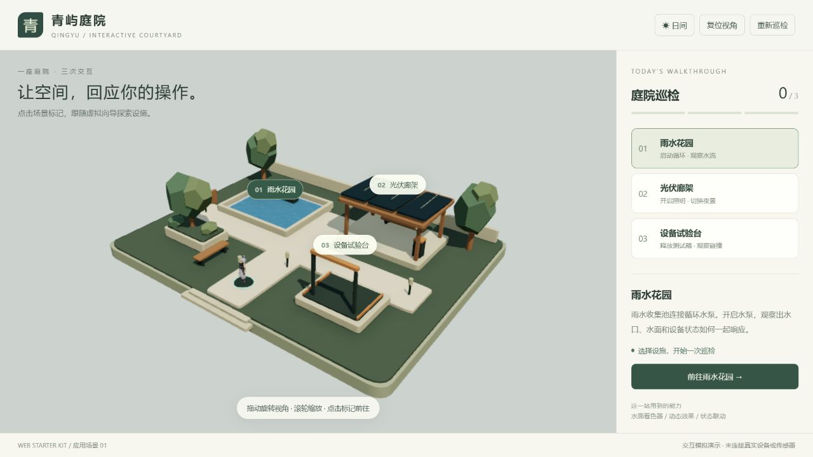
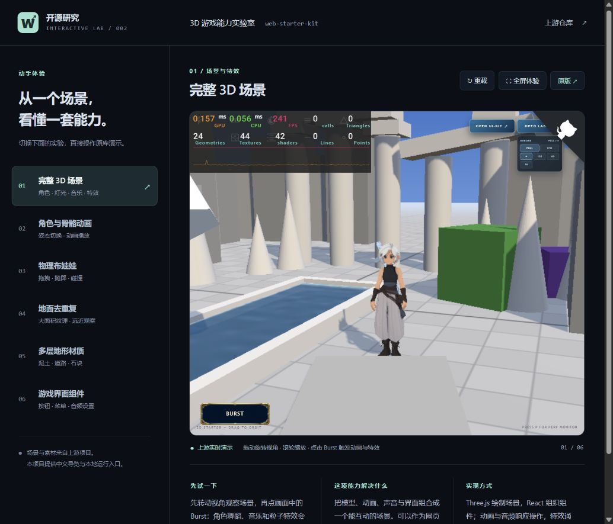

# 002 · Web Starter Kit：3D 人物与舞蹈演示、接入能力

研究结论：对我们当前的精致人物、舞蹈与内容创作目标，参考价值有限。原库主要负责基础三维展示、模型接入和已有动作播放；实际人物与动作资产仍需自己制作或取得并适配。

[返回总索引](../../README.md) · [上游仓库](https://github.com/vibegameengine/web-starter-kit) · [官方在线示例](https://vibegameengine.github.io/web-starter-kit/) · [远端研究网页](https://yydshly.github.io/0915_codex_project/002-web-game-starter/)

**能力摘要：3D 人物模型与舞蹈动作的演示、接入和播放。** 模型与动作资产仍需自行制作或取得并适配。

## 远端发布内容

GitHub Pages 发布研究结论、能力边界及原创架构引导图，页面来源为 `app/`，架构图与索引封面共用 `demo/capability-architecture.svg`。实时 3D 演示保留在本地，需要按下文启动；远端网页不依赖本机服务，不将完整上游运行环境作为公开站点发布。

## 先理解它的价值

**核心在高质量 3D 人物和舞蹈动作资产。这个库不作为当前核心技术方向继续投入，保留为工程参考。**

它可以加载已有模型、播放骨骼动作，并提供灯光、物理、音频、UI、资源压缩和加载等辅助模块。这些能力不能替代人物造型、材质、骨骼蒙皮、编舞与动作修整，也不包含完整的角色/舞蹈创作编辑器。它对我们核心制作成本的节省有限，且没有量化证据证明能显著缩短开发周期。


[打开网页结论与架构引导图](http://127.0.0.1:5175/conclusion.html) · [查看独立架构图](demo/capability-architecture.svg)

[完整研究结论、技术清单与来源区分](notes/CAPABILITIES.md)。Mika、庭院任务和音乐同步是本项目额外制作的内容，不能当作原库自带的创作工具。音乐生成已按用户要求暂停。

## 本次展示什么

### 原创人物：Mika 与舞蹈

[打开 Mika 舞蹈工坊](http://127.0.0.1:5174/dance-studio)。人物几何、五官、发束、衣服、17 根骨骼、蒙皮权重和两段舞蹈均由本地代码创建，没有使用额外的生成服务，也没有借用原人物网格或现成舞蹈数据。

可切换轻快律动、手臂波浪与静态欣赏，暂停、调整 0.5–1.5 倍速度，以及观察正面、侧面、背面和脸部细节。人物采用原创卡通风格；当前动作是程序编排，服装与头发没有独立物理模拟。源码一并包含在累计补丁 `patches/courtyard.patch`，设计和检查记录位于补丁内的 `docs/mika-dance-studio.md`。

已在真实浏览器检查人物细节、动作、暂停、相机和 390px 窄屏。lint、knip、生产构建通过，24 个测试文件中的 199 项测试通过。

### 应用场景：青屿庭院巡检

新增一个可以实际操作的庭院：[打开青屿庭院](http://127.0.0.1:5174/courtyard)。六项原库实验入口保持不变。

1. 点击雨水花园，虚拟向导乘导览盘沿步道前往；到达后启动循环水泵。
2. 选择光伏廊架并开启照明，场景切换到夜间，庭院灯发光。
3. 选择设备试验台并释放测试箱；Rapier 计算下落与碰撞，落地事件写入巡检记录。
4. 完成三项后让向导庆祝；可以复位镜头、切换日夜，或重新巡检。

这是设备状态由页面操作驱动的模拟演示，没有接入真实传感器，也不用于工程安全判定。向导采用悬浮导览盘移动，现有角色素材没有行走动作。庭院造型、设施、路线、任务与中文界面为本次新增；角色、水面、舞蹈特效、阴影工具、资源处理和物理框架复用原库。

源码改动保存在 `patches/courtyard.patch`；启动器自动检查并应用，遇到已有修改冲突会保留现场并停止，不覆盖用户工作。详细设计见应用补丁内的 `docs/courtyard-inspection.md`。



新增场景已在真实浏览器中完成三项巡检、夜间灯光、物理重放、庆祝、重置与环绕镜头检查，窄屏镜头裁切已修正。lint、knip、生产构建通过，23 个测试文件中的 195 项测试通过；这些验证不代表大型场景或手机真机性能结论。

### 原库的六项独立实验

| 实验 | 可以操作什么 | 对应价值 |
| --- | --- | --- |
| 完整 3D 场景 | 旋转、缩放、Burst 动画与特效 | 观察模型、界面、声音和特效如何一起工作 |
| 角色与骨骼动画 | 切换默认姿态、待机、舞蹈、问候 | 将已有角色与动作素材用于交互体验 |
| 物理布娃娃 | 击倒、抛起、拖动肢体、切换重力和表面 | 实时计算跌落、碰撞和身体关节运动 |
| 地面去重复 | 从不同距离与角度观察固定材质效果 | 用较小贴图表现大面积地面 |
| 多层地形 | 调整材质图层、石块覆盖范围、查看遮罩 | 泥土、道路与石块的材质混合 |
| 游戏界面 | 浏览组件、操作按钮、滑块和设置面板 | 复用游戏 UI 基础控件 |

这是一套网页游戏基础工程，不含完整游戏的玩法、关卡、经济系统或任务剧情。AI 角色/技能文档辅助开发，不代表游戏 NPC 已接入大模型。

## 本地启动

环境：Python 3.10+、Git、Node.js 22.15+、npm。首次安装需要联网。

在**本子项目目录**运行：

```powershell
python scripts/demo.py setup
python scripts/demo.py serve
```

准备完成后，两个地址分别是：

- 中文能力导览：[http://127.0.0.1:5175/](http://127.0.0.1:5175/)
- 原版运行环境：[http://127.0.0.1:5174/](http://127.0.0.1:5174/)
- 庭院巡检场景：[http://127.0.0.1:5174/courtyard](http://127.0.0.1:5174/courtyard)
- 原创人物舞蹈：[http://127.0.0.1:5174/dance-studio](http://127.0.0.1:5174/dance-studio)

启动器只监听本机；按 Ctrl+C 同时结束两个服务。页面链接只有启动器运行期间可访问。首次打开会转换模型、压缩图片并准备渲染，之后可复用本地缓存。

端口被占用时，明确选择其他端口：

```powershell
python scripts/demo.py serve --port 5275 --runtime-port 5274
```

导航支持地址锚点，例如 `http://127.0.0.1:5175/#physics` 直接进入物理实验。画面空间不足时使用“全屏体验”或“原版”。

## 版本与目录

| 项目 | 内容 |
| --- | --- |
| 上游固定版本 | `d5f62cb074b506697fb035c420415026bafbe792` |
| 核心技术 | React 19、Three.js、React Three Fiber、Vite 8、Rapier、Howler |
| 上游检出 | `upstream/`，独立安装依赖，已被总仓库忽略 |
| 中文展示入口 | `demo/`，独立于上游业务代码 |
| 复现启动器 | `scripts/demo.py` |
| 设计与运行边界 | [notes/IMPLEMENTATION.md](notes/IMPLEMENTATION.md) |
| 发布状态 | 研究网页通过 GitHub Pages 发布；实时 3D 演示保留本地 |

## 核心机制

1. **资源处理**：导入模型时压缩贴图、几何和动画；FBX 转为 GLB，减少手工加工。
2. **启动流程**：先预载必要文件，再等场景准备好，最后撤下加载界面。
3. **运行优化**：复用几何与材质，缓存静态阴影，按固定时间步推进模拟。
4. **场景隔离**：不同能力有独立实验页，适合先验证单个系统，再组合成游戏。
5. **开发说明**：上游角色和技能文件提供工作规范；实际编程仍需外部 Agent 和工具。

## 验证范围

2026-09-15，在 Windows 本地运行，以浏览器真实画面和操作确认：

- 完整场景能显示；Burst 开启后按钮状态改变，角色播放舞蹈且粒子出现，再次点击可停止。
- 角色实验的 Macarena 切换成功，画面中可见角色动作。
- 布娃娃实验能显示，Knock out 后身体受重力倒地，Stand up 可重置。
- 去重复地面能显示，可从画面观察贴图效果；没有把此观察当作性能测量或算法对照实验。
- 多层地形在 ROAD 遮罩与 BLENDED 视图之间切换，石块密度可从 0.32 调到 0.33。
- UI 组件目录可切换到音频设置；静音后滑块禁用，取消静音恢复。
- 中文导览在窄幅和宽幅浏览器视图中均能显示；六项实验有独立 hash 和原版入口。
- 上游 `npm run build`（包含 TypeScript 检查）通过；主脚本语法检查、Python 编译检查、研究项目索引检查通过。

默认生产构建会去除上游实验页；本展示使用开发服务加载这些页面。若未来打包独立展示，需要显式开启 `VITE_ENABLE_SHOWCASE=true` 并重新验证。

未做手机真机、长期稳定性和性能压测；没有声称全部上游单元测试通过，也未验证音频输出设备的实际听感。

### 本次构建观察到的资源优化

| 资源 | 源文件 | 处理后 |
| --- | --- | --- |
| 角色模型 | 约 4.3 MB | 约 711 KB |
| 舞蹈动画 FBX → GLB | 约 529 KB | 约 38 KB |
| 问候动画 FBX → GLB | 约 397 KB | 约 24 KB |
| 场景音乐 | 约 1.3 MB | 约 662 KB |

这是当前素材与参数的一次构建结果，不代表任意素材都具有相同压缩比例。构建有主 JavaScript 分包超过 500 KB 的提示，但构建成功。

## 实际截图



截图来自本地运行的原库与本项目导览，非概念图。

- [角色舞蹈动画](assets/character-animation.png)
- [布娃娃物理倒地](assets/ragdoll-physics.png)
- [多层地形材质](assets/layered-terrain.png)
- [游戏音频设置组件](assets/game-ui.png)
- [主场景动画与特效](assets/scene-burst.png)

## 音乐与舞蹈同步

`/dance-studio` 已加入音乐创作描述、MiniMax 网页入口、本地音频导入、共同播放/暂停、进度、速度、音量及手工 BPM/第一拍调整。人物姿势跟随音乐播放时间；当前不包含自动节拍检测或自动编舞。

2026-09-15 使用用户指定的本地配置调用 MiniMax music-3.0，接口返回 HTTP 410 / 2153，账号无音乐 API 资格。本次没有生成配乐，需经 MiniMax Audio 网页生成下载后导入。独立调用脚本保存在补丁中的 `scripts/generate-mika-music.py`，密钥不进入浏览器和版本库。同步功能的 lint、构建、knip 与 205 项测试已通过。

## 来源与许可

展示场景、角色、模型、纹理、音频及游戏组件来自上游。研究仓库保存中文导览和复现脚本，不把整套上游源码及素材提交进版本历史。

在本次固定版本的上游根目录未发现统一 LICENSE 文件；部分技能单独带有许可。后续需要分发上游代码或素材时，应先明确对应授权范围，保留各自署名。
