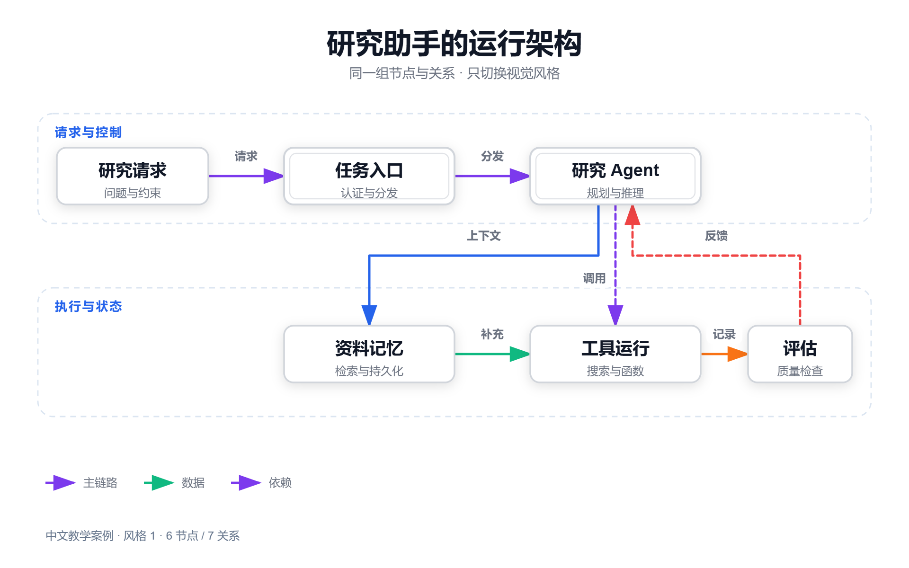

# 003 · Fireworks：技术图生成库、输入与图型全览

> Fireworks 是技术图生成与导出库，由 Agent Skill 绘图规范与命令行工具组成。输入依赖用户或外部大模型整理的图纸数据，库负责绘制、检查与导出；有合规输入时，不强制调用大模型。

[在线展示](https://yydshly.github.io/0915_codex_project/003-fireworks-tech-graph/) · [全部图型与效果](https://yydshly.github.io/0915_codex_project/003-fireworks-tech-graph/diagram-types.html) · [深入分析](notes/analysis.md) · [上游仓库](https://github.com/yizhiyanhua-ai/fireworks-tech-graph) · [总索引](../../README.md)

## 一图理解


[可编辑 SVG](app/capability-map/fireworks-capabilities.svg) · [检查记录](app/capability-map/fireworks-capabilities.checks.json)

## 输入是什么？谁负责理解代码？

| 输入起点 | 谁整理内容 | 交给绘图库什么 |
| --- | --- | --- |
| 代码库、GitHub 仓库、文档、自然语言需求 | 外部大模型 / Agent 或作者阅读资料，提取模块、关系与证据，核对事实，选择图型 | 符合 Fireworks 约定的 JSON，或按其规范编写的 SVG |
| 用户或其他工具已整理好的数据 | 用户或工具将数据转换成 Fireworks 图纸格式；已有合规图纸可直接使用 | 同上，无需再调用大模型理解代码 |

图纸 JSON 通常包含 `nodes`（节点 ID、文字、坐标、尺寸）、`arrows`（起点、终点、关系文字）、图型 `mode`、风格 `style`、画布尺寸，以及可选的分组和领域字段。**不是任意 JSON 都能直接生成图。** [实际输入示例](app/types/dataflow.json)。

Fireworks 不内置一个自动理解任意代码库并保证结论正确的分析模型。自动路由也不等于自动完成所有节点布局，位置和结构往往需要作者或 AI 明确提供。

## 怎样处理，输出什么？

1. **原生 JSON 路线**：读取图纸 → 校验节点和关系 → 应用风格与形状 → 绘制节点、路由连线 → 生成 SVG。
2. **AI 编写 SVG 路线**：AI 参考库内图型规范与模板编写 SVG → 交给原库检查与导出。此路线不能算作原库具备独立的专用图型渲染器。
3. **检查与修改**：检查 XML、箭头、碰撞、几何和构图；部分工程视图还检查领域字段。作者据结果修改图纸，程序检查不验证业务事实。
4. **交付**：SVG 可编辑；PNG 用于文档、README、方案与汇报；离线 HTML 用于查看和交互；GIF 用于受支持语义场景的动态演示，不能将任意图直接动画化。

## 支持哪些图，什么时候用？

按固定版本文档整理为 **33 个展示条目**，覆盖 5 类。部分是领域变体，同义名称合并，数量不代表 33 个独立绘图引擎。12 种视觉风格与图类型是两个维度。

| 类别 | 图类型 / 视图 | 适用问题 |
| --- | --- | --- |
| 通用表达 · 4 | 流程图、比较矩阵、时间轴 / 甘特图、思维导图 / 概念图 | 步骤与分支、方案比较、工期计划、主题整理 |
| 系统与工程 · 7 | 系统架构、C4 评审、云部署、事件流、可观测性、网络拓扑、UML 部署 | 服务分层、职责边界、部署归属、消息系统、运行指标、访问路径 |
| 数据与结构 · 6 | 数据流、ER 实体关系、对象、组件、包、组合结构 | 数据加工、数据库关系、实例快照、模块依赖、内部结构 |
| UML 与行为 · 8 | 时序、状态机、类、用例、活动、通信、Timing 波形、交互概览 | 调用先后、状态变化、类型设计、角色功能、并行活动与交互 |
| AI 领域 · 8 | Agent 架构、记忆架构、多 Agent 协作、工具调用、记忆分类、RAG、Agentic RAG、Agentic Search | 解释 AI 系统的规划、分工、检索、记忆与工具使用 |

[逐项用途、效果与支持方式](notes/diagram-types.md)。本次展厅 15 项由原生 JSON 生成，18 项由 AI 按规范绘制后经原库导出；后者含通信、Timing、交互概览 3 项近似适配。不声称完整 UML 标准认证。

## 对我们的价值

适合把已经理解并确认的技术关系制作成统一风格的图，用于项目介绍、技术文档、设计评审和教学。若重点是自动分析代码、追踪影响或查询图谱，还需要代码分析工具或大模型先整理事实。

本研究网站展示保存的样例与输入，不提供在线大模型、实时绘图或自动扫描仓库服务。

## 能力展示

### 全部图类型与实际效果

[打开 33 个图型与领域视图](app/diagram-types.html) · [完整类型总结](notes/diagram-types.md) · [生成记录](app/types/receipt.json)

按固定版本文档整理 33 个展示条目，每项附 SVG、PNG、离线 HTML、输入与检查记录。包含时序生命线、ER 主外键、类图分栏、状态迁移、活动并行、甘特时间刻度、思维导图等不同记法。

其中 15 项由上游通用 JSON 生成器生成，18 项由本次 AI 按库内规范编写 SVG 后交给原库检查与导出，后者含 3 项近似适配。复用既有 10 项，新增 23 项。33 是本次盘点条目数，包含领域变体，不代表上游有 33 个专用渲染引擎；也不代表全部可生成 GIF。

复现新增图型：`python projects/003-fireworks-tech-graph/src/build_types.py --fireworks upstream/fireworks-tech-graph`。

### 新增：拿实际仓库做分析与出图

[打开 system-prompts-and-models-of-ai-tools 案例](app/prompt-case.html) · [分析说明](notes/system-prompts-case.md)

实际读取目标固定版本，盘点 111 个文件和 32 个资料目录，并分析 Cursor、Kiro、Manus、Amp 的代表性资料。用 Fireworks 实际生成三张中文图：资料结构、Manus 文本描述的循环、用于个人研究助手的建议流程。提供图纸 JSON、来源、SVG、2400×1440 PNG、原生 HTML 和检查记录。第三张为建议流程，未运行目标 AI 产品。

### 原有风格与功能展厅

- **12 风格展厅**：11 套上游 JSON 重新生成，Dark Luxury 保留上游 AI 编写 SVG；切换场景，查看原生离线 HTML，下载 SVG/PNG 和检查输入。
- **中文同结构实验**：研究助手的 6 个节点、7 条关系，在 7 种风格中保持结构与坐标一致；使用严格文字完整性模式。
- **真实拒绝记录**：不存在的目标节点、过长中文标题、缺少错误指标，实际交给原库检查并保留结果。
- **历史研究对照**：复用 Archify 自身中文架构预览与 Graphify 的 FastAPI 原生全量网络，明确历史来源。
- **原理与价值**：区分自然语言理解、图数据、路由、语义检查、视觉检查和导出责任。

展厅切换真实保存的结果，没有在线大模型或实时 JSON 渲染服务。GIF 为上游 1.2.0 发布样片，本次未重新编码。原生 HTML 可离线查看和下载图片；生成新图需运行 Python 工具。

## 实际效果



本次编写的教学架构，经固定版本原生 SVG 生成器和 PNG 导出器生成。不是生产系统或网页截图。

## 版本与来源

| 项目 | 固定研究版本 |
| --- | --- |
| Fireworks | 包版本 1.2.0，提交 `31fea364eda5f1852b1175f3d9e29ea31d22dcb4`；包含主分支未发布质量升级 |
| Archify | 既有 0909 研究：2.17.0-dev.1，`10722002bb8777ecb639d93c49586fae4adf3ae4` |
| Graphify | 既有 0911 研究：0.9.57，`3f82bf7f837a07fb0f7668fbdbd5662801906942` |
| 日期 | 2026-09-15 |
| 许可 | Fireworks MIT；Archify MIT；Graphify Apache-2.0，许可与 NOTICE 随资源保留 |
| 发布方式 | GitHub Pages；推送主分支后由仓库既有工作流构建和部署 |

## 与以前研究的项目有什么差异？

| 需求 | 优先使用 |
| --- | --- |
| 从陌生源码或资料提取实体和关系 | Graphify |
| 交互阅读、追踪路径、讲解与比较前后模型 | Archify |
| 为文章、README、方案和演示生成统一风格配图 | Fireworks |

**最接近的是 Archify。** 两者均依赖作者或 Agent 编写结构化图规格，都重视可复现绘图与检查。Fireworks 新增价值集中在 12 风格、图形语义、工程场景规则和图片交付；Archify 已验证的优势是交互追踪、源码关联与架构差异。Graphify 主要负责更上游的关系提取和图查询。

“Graphify 提取证据 → Agent 核实整理 → Fireworks 出图 / Archify 交互讲解”是建议组合，尚未接通。当前没有量化效率、成本节省或商业回报结论。

## 本地运行

在研究总仓库根目录执行：

```powershell
python scripts/build_web.py
python -m http.server 8773 --bind 127.0.0.1 --directory web
```

打开 http://127.0.0.1:8773/003-fireworks-tech-graph/ 。

## 复现

准备 Python 3.10+、Node.js 22.12+、Chrome。上游完整检出放在已忽略的 upstream 目录。可选 Puppeteer 仅用于原生 PNG 导出，不调用模型服务。

```powershell
git clone https://github.com/yizhiyanhua-ai/fireworks-tech-graph.git upstream/fireworks-tech-graph
git -C upstream/fireworks-tech-graph checkout 31fea364eda5f1852b1175f3d9e29ea31d22dcb4
npm install --prefix upstream/fireworks-tech-graph --ignore-scripts --no-save --package-lock=false puppeteer-core@25.3.0
python projects/003-fireworks-tech-graph/src/generate.py --upstream upstream/fireworks-tech-graph
python projects/003-fireworks-tech-graph/src/export_png.py --upstream upstream/fireworks-tech-graph
python projects/003-fireworks-tech-graph/src/verify.py
python scripts/projects.py sync
python scripts/projects.py check
python scripts/build_web.py
python scripts/check_web.py
```

已有检出直接复用。生成脚本核对固定提交，保存输入、布局报告、检查结果、原生 HTML 与哈希。Style 8 使用上游 SVG。HTML 仅补 description 元数据，查看器逻辑不变。PNG 使用原库 svg2png.js 真实渲染并回读尺寸。

## 验证边界

[verification.json](app/verification.json) 记录 19 张 SVG × 5 项程序检查、19 张 PNG、19 份离线 HTML、7 套同结构中文数据与 3 个负例。程序检查不能证明业务事实真实，也不能替代逐图视觉检查。已目视抽查中文风格 1、3、5 的 PNG，中文可读且无明显裁切；其余图未逐张目视验收。原生 HTML 浏览器控件没有逐项交互验收。

## 文件组织

- app/：独立静态展厅、原生产物与历史对照。
- src/：生成、导出和完整性检查脚本；不改上游实现。
- assets/：研究首页预览与素材说明。
- notes/analysis.md：能力、技术原理、差异、价值与边界。
