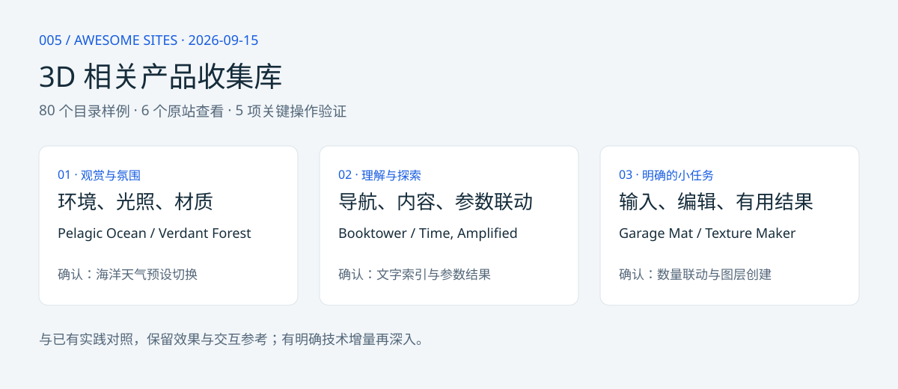

# 005 · Awesome Sites：3D 相关产品收集库

[Awesome Sites 原展厅](https://awesomesites.ai/) 是以 3D 场景及相关交互产品为主要关注点的作品收集网站，也包含二维工具、内容与音乐样例。我们将其作为 **3D 相关产品收集库** 保留。

**我们的结论：很多效果与已有山居、河谷、人物、赛车和展厅实践重合，技术增量目前有限。主要用途是效果、交互和实现线索参考；没有逐项核查原作源码，也没有确认新增的可复用技术能力。**

[完整理解与后续取舍](notes/understanding.md)。后续仅对明显更好的细节、尚未实现的能力或可复用实现单独深入，不逐项重复复现。

## 入口

- [在线产品收集库](https://yydshly.github.io/0915_codex_project/005-awesome-sites/)

- [本地展示](http://127.0.0.1:8775/005-awesome-sites/) · [静态页面](app/index.html)
- [80 个案例数据](app/cases.json) · [完整参考笔记](notes/analysis.md)
- [目录来源快照](notes/catalog-snapshot.json) · [验证记录](notes/evidence.json)



## 本轮补全

2026-09-15 重新展开原展厅，当前显示 80 个案例且不再出现 Load more。保留原有 16 个，新增 64 个，全部具备原作链接、本地预览图、中文说明、具体参考点和验证边界。名称、原作地址和预览文件名与浏览器目录逐条组成的规范化记录指纹一致。

用途分为视觉场景、空间导航、交互学习、实用与创作、游戏与协作、内容与叙事、声音与表演。分类为独立整理，不等于原站分类。

| 证据等级 | 数量 | 范围 |
| --- | --- | --- |
| 关键操作已验证 | 5 | 海洋预设、地砖数量、书架索引、算法参数、纹理图层 |
| 原站界面已查看 | 1 | Forma 默认界面 |
| 仅目录与预览 | 74 | 包含本轮新增 64 个，不宣称已进入原作测试 |

Mini Moto 与昨天研究的同一原作相连，在卡片详情中提供历史研究入口，不重复计算为本轮实测。介绍含糊的 Moonlit Forge、Sketch Golf 等保留信息不足提示，不根据名称补造能力。

## 对我们的参考价值

- 用具体效果明确想要的材质、光照、人物动作和镜头。
- 对照已有山居、河谷、人物与展厅，寻找值得改进的细节。
- 参考参数联动、编辑、游戏反馈与叙事方式。
- 只有找到源码或可靠技术说明后，才判断是否可提取实现。当前全量目录不是可复用技术库。

## 构建与维护

原生 HTML / CSS / JavaScript，无新增前端依赖。图片保存在 app/images；正文与预览可离线浏览，原作入口需联网。

```sh
python projects/005-awesome-sites/src/build.py
python scripts/projects.py sync
python scripts/build_web.py
python scripts/check_web.py
python -m http.server 8775 --bind 127.0.0.1 --directory web
```

app/cases.json 是展示内容来源。src/expand_catalog.py 可从本轮 64 条目录整理记录补充数据，重复执行保留既有证据。src/fetch_previews.py 下载已核对的预览地址并复用现有文件。src/stage.py 准备相同内容的静态发布目录。

2026-09-15 已通过 GitHub Pages 发布。线上标题、80 张案例卡片、案例数据和代表性预览图片可访问；与已有实践重合、参考价值及验证范围已写入网页。

## 检查与边界

检查 80 条数据唯一性与必填字段、原目录来源一致性、80 张图片、静态链接与锚点、JavaScript 语法、各分类及复位逻辑、元数据索引和 HTTP 入口。未做本地页面浏览器截图或交互测试。原有原作操作验证与本地静态检查分别记录。

未验证所有原作的源码、AI 调用、生成成本、保存导出、多人同步、性能或实际收益。由 AI 制作不代表运行时依赖模型。

## 来源

案例简介按展厅信息归纳，预览图来自 Awesome Sites，具体地址见目录快照。图片不是本次生成或复现成果；原作与预览归各自权利人所有。中文参考点、结构图和展示页为原创研究整理，未复制或重新托管原作源码。
