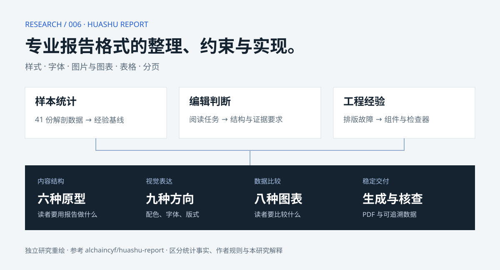

# 006 · Huashu Report：专业报告格式整理与约束实现

从专业资料中梳理样式、字体、图片与图表编排、表格和分页等格式信息，形成约束与制作流程，实现相应展示效果；兼有内容组织规范，核心价值是经验整理与复用，底层技术增量有限。



[返回总索引](../../README.md) · [上游仓库](https://github.com/alchaincyf/huashu-report)

## 研究版本与范围

- 固定版本：`bdc08bee5077462e1300431408c5237438a22d00`
- 研究日期：2026-09-15
- 状态：已总结；完成代码阅读、数据复算、小范围图表探针，未复现完整报告生产。
- 上游许可证：MIT，见 [许可副本](notes/UPSTREAM-LICENSE.txt)。机构原报告不随本项目再分发。
- 页面内容：六种内容原型、九种视觉方向、八种图表、两组失效对照图、十二项细节处理、约束来源和实现边界。

所有原型、视觉缩略图与图表均为本研究独立重绘的说明图，不是机构截图或上游生成成品。示例数字只解释图形语义。

## 核心结论

我们的理解：本质上是从专业报告与相关资料中梳理格式信息，包括样式、字体、图片和图表如何编排、表格如何展示、页面如何分页，再通过约束和工具实现相应效果。这里的图片侧重使用与编排规范，不代表仓库自带可复用的机构图片素材库。

价值主要在经验整理、统一输出和减少返工。对寻求新模型、新算法或新研究能力的目标，技术增量有限；对已经有成熟报告流程的人，新增价值相对更小。“机构级”描述制作目标，不保证产生机构级研究洞见。

这个库把制作知识拆成可执行步骤。六种原型决定内容组织，九种方向决定视觉系统，图表组件提供可复用表达；它们不是 54 套已完成的模板。

约束的证据强度不同：页数与横竖版可从 JSON 复算；一页一结论、附录上限属于作者的设计取舍；中文字号和边距规则包含交付经验。不能将所有规则都称为量化实验结论。

复算 41 份解剖记录：页数中位数 34、竖横比 35:6、含书签 23/41。详见 [复算结果](notes/baseline.json) 和 [研究依据](notes/analysis.md)。颜色统计未独立重做分类，网页明确标为上游报告。

实现仍有边界：横条图的负值输入会产生负宽度；图号检查没有全面检查连续性；目录回填依赖正则；警报并非严格退出门禁。网页区分文档目标与实际代码覆盖范围。

## 本地运行

从总仓库根目录运行：

```sh
python -m http.server 8766 --bind 127.0.0.1 --directory projects/006-huashu-report/app
```

打开 [本地网页](http://127.0.0.1:8766/)。纯静态网页，无第三方前端依赖，资源使用相对路径。

## 验证与站点汇总

```sh
node --check projects/006-huashu-report/app/app.js
node projects/006-huashu-report/scripts/check.mjs
python projects/006-huashu-report/scripts/recompute_baseline.py upstream/huashu-report --output projects/006-huashu-report/notes/baseline.json
python scripts/projects.py sync
python scripts/projects.py check
python scripts/build_web.py
python scripts/check_web.py
```

交互验证在内存中检查六种选择状态、图解数量、内容容器、固定版本链接和 SVG 数值；不等于浏览器视觉测试。基线探针需要已检出的上游仓库。

总仓库构建器将 `app/` 汇总至 `web/006-huashu-report/`。通过现有 GitHub Pages 工作流发布；线上验证成功后在项目元数据中登记演示地址。
