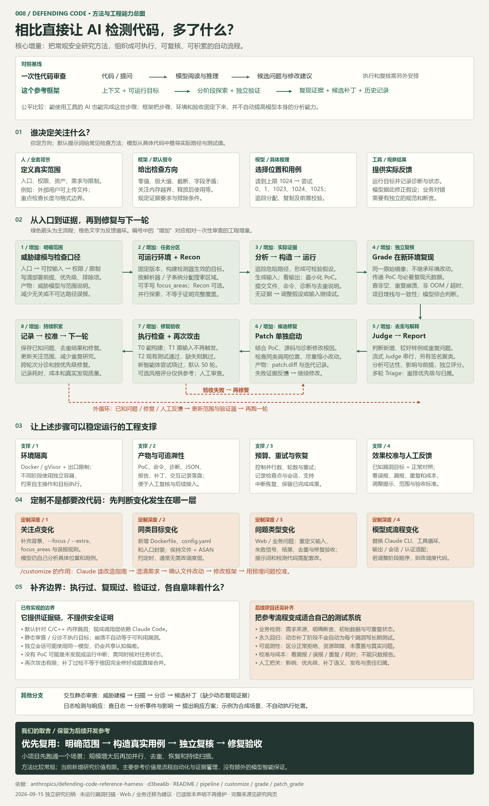
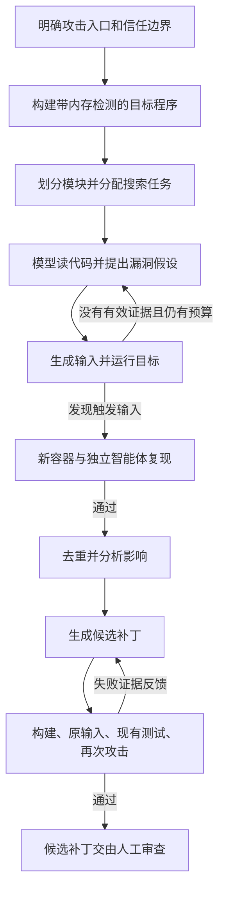

# 008 · Defending Code：AI 漏洞研究流程与复用思路

**核心理解：大模型阅读代码、理解输入和业务约束，提出安全漏洞假设，构造触发输入；工具实际运行程序，独立验证结果，再尝试修复。**

现成实现使用 Claude Code。提示词、流程设计和执行验证思路可以用于其他模型，但自动运行整个框架需要适配模型调用与工具执行层。

[返回总索引](../../README.md) · [上游仓库](https://github.com/anthropics/defending-code-reference-harness) · [深入分析](notes/analysis.md) · [复用思路](notes/reuse.md) · [源码依据](notes/sources.md)

## 能力与当前价值判断

它将大模型的代码分析、触发输入构造、运行验证、独立复核、去重和补丁验收串成可重复的安全研究流程。默认实现依赖 Claude Code，面向 C/C++ 内存漏洞；其他模型或业务问题需要适配。

检查思路本身属于常规安全研究方法。对当前需求，新增研究价值有限；值得保留的是任务分工、隔离环境、证据记录、失败恢复和修复验收的工程实现。后续开发项目时，先按实际场景复用“明确范围 → 真实用例 → 独立复核 → 修复验收”，不必照搬整个框架。它不能自动提高模型能力，也不能保证发现全部问题。

## 基本信息

| 项目 | 内容 |
| --- | --- |
| 整理日期 | 2026-09-15 |
| 研究状态 | 已总结：文档阅读和核心源码核对 |
| 固定版本 | `d3bea6b5793b5f3d59a75ebe69a58efa88383145` |
| 上游许可证 | Apache-2.0 |
| 核心技术 | Python 3.11+、Claude Code CLI、Docker、gVisor、ASAN |
| 默认自动扫描对象 | C/C++ 内存安全漏洞 |
| 验证范围 | 未安装依赖、执行扫描、实测模型效果或验证候选补丁 |
| 维护状态 | 所读版本 README 声明不维护、不接受贡献 |

## 网页讲解

### 完整思路总图

[打开可缩放总图](app/map.html) · [SVG 矢量原图](app/overview-map.svg) · [PNG 图片](assets/overview-map.png)

总图覆盖一次性审查对照、人与模型分工、八阶段闭环、环境隔离、证据记录、重试恢复、四种定制深度、校准指标、能力边界，以及后续开发可优先复用的部分。它是概念研究闭环，包含可选步骤与独立命令，不代表单条命令会自动运行图中的所有环节。

当前取舍：常规检查方法本身新增研究价值有限，保留为后续项目实现自动检查、独立验证和修复验收时的参考。

已完成 [交互研究网页](app/index.html)，重点展示发现问题与定制方法：

- 五步发现过程：范围 → 分区 → 假设 → 输入实验 → PoC 提交。
- 可调数量和修复开关的长度回绕教学实验，区分数学示意与真实执行证据。
- 独立验证、去重、影响报告和补丁分层验收。
- 四种定制层次与 C/C++、Web 越权、优惠券重复核销三种场景。
- 六项适配要求、源码改动范围、可编辑复制的定制任务说明。
- 配置字段、首次运行与已知问题校准方法。

页面使用原生 HTML / CSS / JavaScript，无需安装前端依赖；已接入现有静态站构建。运行方式见 [网页说明](notes/web.md)。已部署到 GitHub Pages：[在线讲解页](https://yydshly.github.io/0915_codex_project/008-defending-code-harness/) · [可缩放总图](https://yydshly.github.io/0915_codex_project/008-defending-code-harness/map.html)。

## 先回答三个容易混淆的问题

### 1. 是 Claude 专用吗？

**现成程序绑定 Claude；方法可以跨模型复用。**

| 内容 | 复用方式 |
| --- | --- |
| 审查提示词、阶段分工、验证标准 | 可交给其他模型参考，需要按其能力调整 |
| 容器构建、输入保存、运行检查、结果记录 | 很多代码可以保留，但要检查模型调用和环境假设 |
| Claude Code 的文件读写、命令执行、会话恢复 | 其他模型需要自己的智能体运行层来提供 |
| 直接把模型名称换成其他厂商模型 | 当前没有通用切换接口，不能直接这样使用 |

通过不同云平台接入 Claude，与换成其他厂商的模型，是两个不同问题。模型名称可配置也不代表天然兼容所有模型。[调用层依据](notes/sources.md)

### 2. 是设定一套规则检查代码质量吗？

**规则主要定义研究范围、工作步骤和验收标准；具体可疑路径和触发输入由模型分析并探索。**

| 类型 | 主要目标 | 常见方法 |
| --- | --- | --- |
| 格式与规范检查 | 风格一致、避免明显用法问题 | 确定规则与语法分析 |
| 功能测试 | 业务行为符合需求 | 输入、预期结果与断言 |
| 安全静态分析 | 发现危险调用或数据流 | 规则、控制流和数据流分析等 |
| 本框架的自动漏洞研究 | 寻找并证明某条路径存在安全问题 | 模型假设、构造输入、执行、独立复现 |

它也包含静态审查入口，但自动流水线会继续寻找运行证据。理解业务的作用是判断攻击者能控制什么、影响是否成立；输出重点是安全漏洞，而非全面的业务质量报告。

### 3. 可以理解成自动生成测试用例并验证吗？

**可以，但这里通常生成的是“用于证明漏洞存在的输入”。**

PoC 是能够展示问题的实例。默认流水线中，通常是一个触发崩溃的文件及其运行命令。它未必是已放进项目测试目录、可长期在 CI 中运行的自动化测试。

## 工作流程

威胁建模可以先通过交互式技能完成；自动 Recon 是可选步骤，去重 Judge 在流式模式启用，Patch 是单独命令。图展示整体研究闭环，具体条件见[深入分析](notes/analysis.md)。

## 用一个例子理解

以下是方法示意，不是本次实际发现的漏洞。

1. 图片解析程序按文件中的数量字段计算要分配的内存。
2. 模型发现计算可能整数溢出，怀疑分配空间小于后续写入量。
3. 模型生成带特殊字段的图片文件，实际运行解析程序。
4. ASAN（运行时内存错误检测工具）报告越界写入的位置和调用堆栈。
5. 独立验证者在全新容器重跑，排除修改环境造成的假象。
6. 模型修改长度计算和边界检查；工具验证编译、原输入及已有测试。
7. 新智能体尝试改变输入绕过修复，最后保留补丁和证据供审查。

模型提出假设，检测器提供运行证据，真实影响还需要结合调用方式和部署条件判断。

## 能力范围

| 能力 | 输入与输出 | 边界 |
| --- | --- | --- |
| 威胁建模 | 源码、文档、环境信息 → 入口、资产、信任边界 | 模型可能缺少真实部署信息 |
| 静态扫描与分诊 | 源码和发现列表 → 核实、去重、排序后的候选问题 | 不执行目标，不能当作动态复现 |
| 自动漏洞发现 | 可运行目标 → PoC、复现记录、影响报告 | 默认面向 C/C++ 内存错误 |
| 补丁生成与验证 | 已验证问题 → 修改和验收结果 | 通过检查不等于证明程序安全 |
| 日志检测与响应 | 日志、源码、线索 → 事件与影响分析、响应建议 | 示例使用合成场景，不自动执行响应处置 |
| 项目适配 | 构建方法、漏洞目标、检测信号 → 调整后的流程 | 需要实际工程适配和运行验证 |

## 对我们的参考价值

**把模型的推测转成可执行实验，用独立复现约束结论，把失败证据反馈给下一轮改进。**

可复用的设计包括按模块分工、发现者与验证者分离、结构化保存证据、补丁分层验收、限制循环预算。若用于业务测试，还要增加明确需求和预期结果，不能仅以“不崩溃”作为正确标准。[跨模型与业务测试复用](notes/reuse.md)

## 本次完成与未验证事项

- 已整理能力范围、Claude 依赖、工作流程、验证机制与复用方向。
- 已核对固定提交的调用层、发现与验证、补丁验收、沙箱和相关文档。
- 当前是研究资料子项目；未实测发现率、误报率、扫描成本或跨模型效果。
- 上游代码通过固定版本链接引用；本子项目为中文归纳和方法分析。

## 阅读顺序

1. [深入分析：每个阶段究竟做什么](notes/analysis.md)
2. [复用思路：其他模型与业务测试怎么接](notes/reuse.md)
3. [来源与核对记录](notes/sources.md)
