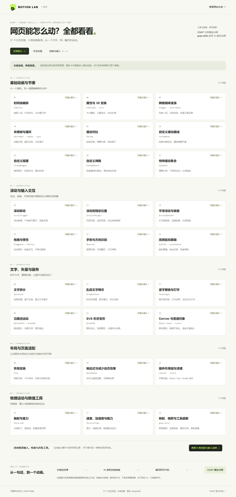

# 009 · GSAP Skills：AI 动画开发指导与领域化应用

[返回总索引](../../README.md) · [上游仓库](https://github.com/greensock/gsap-skills) · [在线能力实验](https://yydshly.github.io/0915_codex_project/009-gsap-skills/#overview)

## Skill 能力与定制开发地图

[](notes/understanding.md#skill-定制开发地图)

*绿色展示上游已有的指导能力；米色展示建议定制的项目规则。下半部提供优化示例、文件组织、验证流程和下次定制的填写清单。验证脚本与反馈流程需要自行实现，本图不代表已安装定制 Skill。*

[详细介绍与定制说明](notes/understanding.md) · [浏览器看图](https://yydshly.github.io/0915_codex_project/009-gsap-skills/research.html#skill-map) · [网页整体能力架构图](assets/capability-guide.svg) · [体验完整产品页](https://yydshly.github.io/0915_codex_project/009-gsap-skills/showcase/)

## 从通用指导到具体领域

[](notes/understanding.md#从通用指导到具体领域我们的理解过程)

大模型根据具体用户任务筛选与应用规则，提出领域方案；Skill 提供指导，测试验证结果。[浏览器看图](https://yydshly.github.io/0915_codex_project/009-gsap-skills/research.html#understanding-journey)。

## 结论与意义

**gsap-skills 将 GSAP 的 API 用法、动画范例与性能实践整理成 AI 可按需读取的指导。** 它通过触发描述、条件规则、代码示例和注意事项，帮助 AI 选择实现方式、处理适配与资源清理。网页中实际执行动画的是 GSAP，Skill 本身不播放动画，也不提供新的动画引擎。

**对我们的意义：复用开发经验，作为定制领域 Skill 的参考。** 通用规则针对共同技术问题；大模型结合用户任务、页面内容与约束，筛选规则、选择效果和调整参数。产品目标判断与跨工具选型需要额外指导，不能全部归功于 GSAP Skill。

定制时按“适用条件 → 决策原则 → 可调参数 → 验收方法”组织，只保留会改变 AI 决策的信息。把反复验证的经验沉淀为规则；检查脚本和测试结果提供执行依据。文字指导不是强制校验，不会自动训练模型、改写技能或保证审美、帧率和业务收益。

本项目用 **27 个真实交互实验、八类技能目录、六项接入资料和一个完整耳机产品页** 辅助理解。它们展示 GSAP 实现与技能使用思路；尚未进行同模型、同任务下“有无 Skill”的效率和质量对照评测。

## 基本信息

| 项目 | 内容 |
| --- | --- |
| 状态 / 日期 | 已总结 / 2026-09-15 |
| 技能仓库固定版本 | `aed9cfd3277740755f6bfc1155c7aa645403b760` |
| 技能许可证 | MIT |
| 动画运行库 | GSAP 3.15.0；package.json 与 package-lock.json 锁定 |
| 运行库许可证 | GSAP Standard License；不是技能文件的 MIT |
| 技术栈 | 原生 HTML、CSS、JavaScript、SVG、Canvas |
| 在线发布 | 已部署至 GitHub Pages；[发布与验证记录](notes/publishing.md) |

## 页面入口

- **场景实战**：[MONO ONE 新品发布页](https://yydshly.github.io/0915_codex_project/009-gsap-skills/showcase/)，用完整浏览与选择流程展示动效；[实现、验证与素材说明](notes/showcase.md)。
- **全部能力**：按五个类别列出 27 个实验，点击进入。
- **交互实验**：真实运行、播放/暂停/倒放/调速/进度，或各实验专属控件。
- **技能与接入**：八类技能的用途、API 清单、框架代码与六项外部工具资料。



[手机实验截图](assets/mobile-expanded.png)

## 27 个真实实验

| 分类 | 编号与能力 | 真实机制 |
| --- | --- | --- |
| 基础与节奏 | 01 时间线；08 属性与 3D 变换；09 网格错峰；10 关键帧与循环 | timeline、CSSPlugin、stagger、keyframes、repeat、yoyo、labels |
| 缓动 | 02 缓动对比；18 自定义曲线；19 摇摆；20 弹跳；21 特殊缓动 | 内置 ease、CustomEase、CustomWiggle、CustomBounce、EasePack |
| 滚动 | 03 滚动联动；13 滚动定位；14 平滑滚动与视差 | ScrollTrigger pin/scrub、ScrollToPlugin、真实 ScrollSmoother 独立子页面 |
| 输入 | 07 拖拽惯性；15 手势识别；23 高频鼠标跟随 | Draggable、Inertia、Observer、quickTo/quickSetter |
| 文字 | 04 字符入场；11 乱码揭示；27 逐字替换 | SplitText、ScrambleText、TextPlugin |
| 图形 | 05 路径描边与跟随；12 SVG 变形；26 画布与普通对象 | MotionPath、DrawSVG、MorphSVG、对象补间与 ticker |
| 布局与适配 | 06 布局变换；24 响应式；25 组件作用域与清理 | Flip、matchMedia、context/revert |
| 物理与工具 | 16 抛射重力；17 速度/加速度/阻力；22 映射与吸附 | Physics2D、PhysicsProps、gsap.utils |

按时间播放的实验不无限自动循环。系统“减少动态效果”偏好会关闭自动播放并减少布局过渡、拖拽惯性和平滑滚动。仍允许用户主动播放。

## 八类技能全览

| 技能 | 覆盖内容 | 页面展示方式 |
| --- | --- | --- |
| gsap-core | 基础属性、缓动、错峰、控制、响应式 | 实验与 API 索引 |
| gsap-timeline | 顺序、重叠、标签、嵌套、播放控制 | 实验与 API 索引 |
| gsap-scrolltrigger | 触发、固定、联动、吸附、批量、横向、外部滚动接入 | pin/scrub 实验，其他扩展能力说明 |
| gsap-plugins | 文本、SVG、滚动、交互、物理、缓动与开发工具 | 插件实验与工具资料 |
| gsap-utils | 16 项数值、集合、选择器与单位工具 | 映射/吸附/插值/随机实验，完整函数索引 |
| gsap-react | useGSAP、作用域、依赖更新、contextSafe、SSR | React/Next.js 接入说明，未运行 React |
| gsap-frameworks | Vue、Svelte、Nuxt 生命周期与动态导入 | 原生 context 实验及框架代码说明 |
| gsap-performance | 变换、批量读写、复用、减少工作与清理 | 高频更新与清理实验，不作帧率跑分 |

**六项外部资料**：MotionPathHelper、GSDevTools、PixiPlugin、EaselPlugin、CSSRulePlugin、Webflow Interactions。页面明确说明用途和依赖，未宣称这些工具或外部引擎已在本页运行。

## 运行

本项目已保存浏览器所需的固定版本文件，预览不需要 CDN。

在本子项目目录执行：

```sh
python -m http.server 8099 --bind 127.0.0.1 --directory app
```

打开 <http://127.0.0.1:8099/#overview>。直接进入示例：`#demo-12` 为 SVG 变形，`#demo-14` 为平滑滚动，`#guides` 为技能与接入。也可使用 `npm start`。

重新提取运行库：

```sh
npm ci --ignore-scripts --no-audit --no-fund
npm run vendor
```

总仓库构建命令：

```sh
python scripts/projects.py sync
python scripts/projects.py check
python scripts/build_web.py
python scripts/check_web.py
```

构建到 `web/009-gsap-skills/`。资源均使用相对路径；ScrollSmoother 的 `smooth.html` 与脚本一同发布。

## 实现原理

### 技能层

`skills/llms.txt` 提供名称、摘要和触发词。各 `SKILL.md` 描述适用条件并给出 API、示例和工程规则。支持 Agent Skills 的工具按需将其加载到模型上下文，再结合项目代码生成实现；加载机制由宿主 AI 工具负责。

本项目遵循时间线编排、插件注册、transform 位移、滚动容器与动画子元素分离、上下文清理以及减少动态效果等指导。参考文件存在个别不精确表述，例如 shuffle 是否原地修改、contextSafe 是否自动移除事件监听；页面说明以实际运行 API 行为为准。

### 动画层

GSAP 随浏览器绘制节奏更新时间线。缓动把时间映射为变化进度，各插件处理其专属对象：路径、文字包装、滚动位置、布局差异或输入事件。Canvas 示例由 GSAP 修改对象数值，再由 ticker 绘制；没有伪装成 PixiJS 接入。

ScrollSmoother 需要页面级滚动，因此在独立 iframe 内运行，避免改变实验室主页面。退出实验时销毁 iframe。其他示例切换时清理 context、ScrollTrigger、Observer、Draggable、SplitText 和 ticker 回调，避免残留。

## 文件

- `app/index.html`、`style.css`：全览、实验与技能说明界面。
- `app/app.js`：原始七个实验、页面导航、共享控制与生命周期。
- `app/extra-demos.js`：新增二十个真实实验。
- `app/catalog.js`：分类目录、八类技能、外部工具说明。
- `app/smooth.html`、`smooth.js`：独立平滑滚动实验。
- `app/vendor/`：官方 GSAP 浏览器构建，保留版权头与 README。
- `scripts/vendor.mjs`：从锁定 npm 依赖提取浏览器文件。
- `scripts/verify.cjs`、`verify-catalog.cjs`：浏览器行为检查，环境需提供 Playwright/Chromium。
- `assets/`：实际运行截图；`notes/verification.md`：验证记录。

## 来源与边界

- [技能仓库固定版本](https://github.com/greensock/gsap-skills/tree/aed9cfd3277740755f6bfc1155c7aa645403b760)：MIT，依据指导独立实现。
- [GSAP 官方文档](https://gsap.com/docs/v3/)与 [3.15.0 npm 包](https://www.npmjs.com/package/gsap/v/3.15.0)：运行机制和插件。
- [GSAP Standard License](https://gsap.com/standard-license)：动画运行库条款，版权信息保留在 app/vendor。

本项目不构成所有组合场景的穷举。物理插件不是刚体碰撞引擎；3D 变换不是模型生成；技能文件不是设计质量保证，也不能代替真实项目的性能与兼容性验证。
