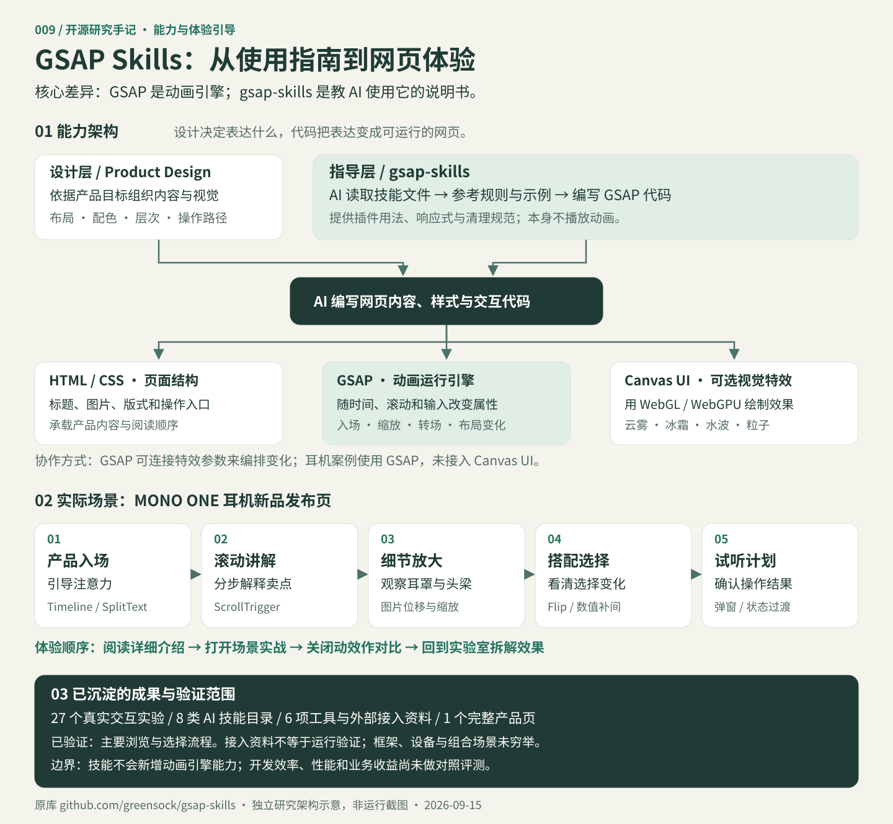
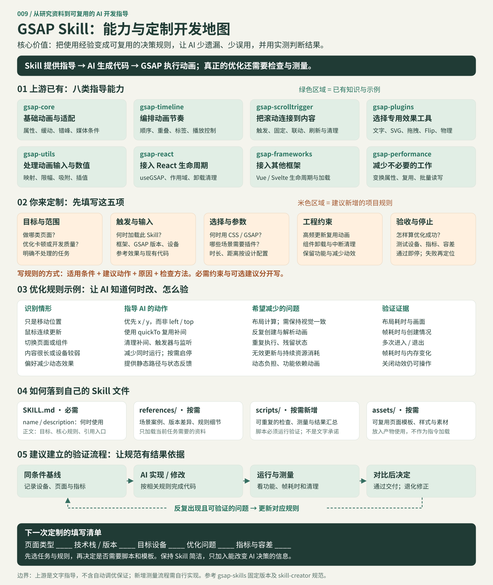
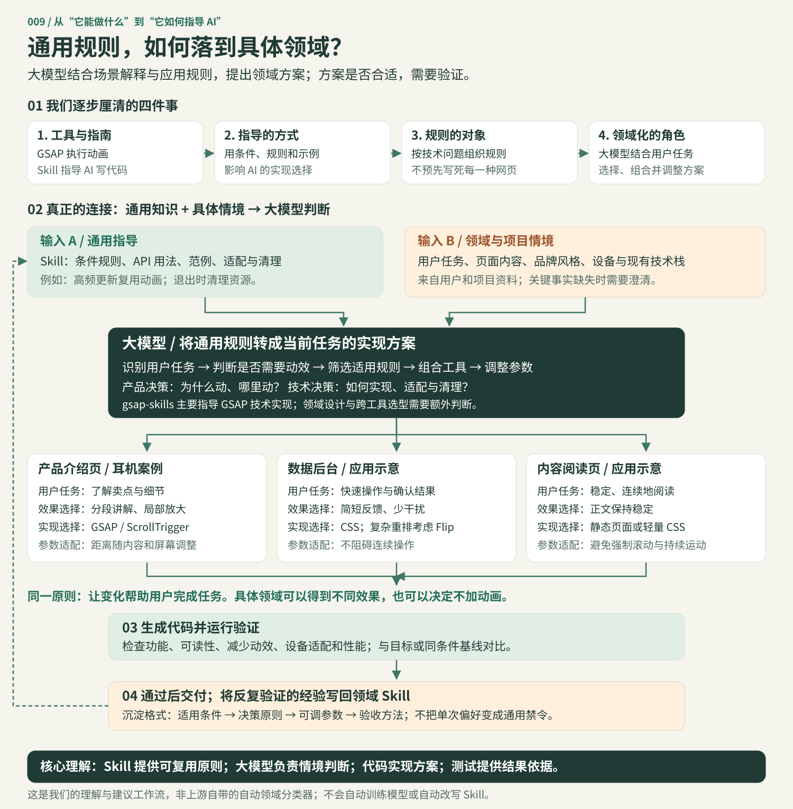

# 能力架构与研究汇总

[回到项目介绍](../README.md) · [在线详细介绍](https://yydshly.github.io/0915_codex_project/009-gsap-skills/research.html) · [体验产品页](https://yydshly.github.io/0915_codex_project/009-gsap-skills/showcase/)

## 一张图理解

本图是独立整理的架构与体验引导，不是运行截图。可编辑源文件为 `scripts/build-guide.py`，输出独立 SVG，README 与网页使用相同内容。

## 昨天的 GSAP 与今天的 gsap-skills

GSAP 是在浏览器中执行动画的 JavaScript 库；gsap-skills 是 AI 写代码时参考的技能文件。开发链路为：用户提出需求 → AI 参考技能 → 编写网页代码 → 浏览器通过 GSAP 执行动画。技能文件不参与网页运行，网页无需实时调用 AI。

昨天的前端视觉实验室已经使用 GSAP。今天研究的是同一引擎的 AI 使用指南，以及能力目录和完整产品场景；没有新增一个动画引擎。没有这套技能，也可以使用 GSAP 实现相同效果。是否提高开发效率、代码正确率，需要同任务对照验证。

## 四项能力如何协作

| 项目 | 所处环节 | 提供什么 | 本次关系 |
| --- | --- | --- | --- |
| Product Design | 设计阶段 | 内容组织、布局、配色、视觉层次 | 来自前次研究的相关能力，本次耳机页未调用该插件 |
| gsap-skills | AI 编写代码阶段 | API 规则、插件示例、适配与清理建议 | 参考技能规范，不作为运行依赖 |
| GSAP | 网页运行阶段 | 时间线、滚动联动、属性与布局变化 | 27 个实验及耳机场景的动画引擎 |
| Canvas UI | 网页运行阶段 | WebGL / WebGPU 特效组件 | 前次研究的云雾、冰霜等；本次耳机页未接入 |

GSAP 可通过组件开放的参数控制特效强度与时间，组合方式取决于具体组件接口。这是可扩展思路，不是本次耳机页已经实现的接入。

## 按用户任务理解效果

| 用户任务 | 可见效果 | 实现 | 用途 |
| --- | --- | --- | --- |
| 第一眼认识产品 | 标题、产品依次入场 | Timeline、SplitText | 建立信息主次 |
| 向下了解卖点 | 产品固定、说明分段切换 | ScrollTrigger | 连续解释内容 |
| 查看设计细节 | 平移并放大产品图 | 属性补间 | 对齐描述与观察部位 |
| 选择搭配 | 配件移入已选区域、数量变化 | Flip、对象补间 | 反馈选择结果 |
| 生成试听计划 | 弹窗与完成状态切换 | 原生表单、dialog、GSAP 过渡 | 形成操作闭环 |

表单选择和计划生成是普通网页逻辑，GSAP 负责过渡表现。产品图是二维概念图，局部放大不是三维模型自由旋转；试听计划只在本地显示。

## 怎样沉淀与复用

按“能力 → 适用场景 → 实际案例 → 实现工具 → 验证边界”记录。当前成果包括 27 个真实实验、8 类技能目录、6 项外部资料和 1 个完整产品页。复用时先决定用户任务，再选择布局、动画与局部特效。

已走通主要交互和动效开关；不将框架接入说明写成运行结果，也不将视觉效果写成已证明的转化率提升。详见[实验验证](verification.md)和[场景实现与验证](showcase.md)。

## 来源

- [gsap-skills 固定版本](https://github.com/greensock/gsap-skills/tree/aed9cfd3277740755f6bfc1155c7aa645403b760)
- [GSAP 官方文档](https://gsap.com/docs/v3/)
- [Canvas UI 官方说明](https://canvasui.dev/)
- [前次前端视觉研究](https://yydshly.github.io/0913_codex_project/011-frontend-visual-lab/research.html)

## Skill 定制开发地图

此图用于下次定制自己的 GSAP 开发 Skill。上游已有的是八类文字指导与代码示例；项目规则、测量脚本、验收标准和反馈流程是建议新增内容。本次仅制作开发地图，没有创建或安装新的 Skill。

### 使用这张图

1. 填写页面类型、技术栈与版本、目标设备、优化问题、指标和容差。指标按项目选择，避免统一承诺帧率或收益。
2. 从八类上游能力中选择相关部分。不要把所有文档一次性放进上下文。
3. 把经验写为“条件 → 动作 → 原因 → 检查方法”，区分必须满足的约束与可选建议。
4. 在 SKILL.md 中保留明确的名称、触发描述、核心规则与引用入口；复杂案例放 references；重复、可确定执行的检查放 scripts；产物模板放 assets。简单 Skill 可以只有 SKILL.md。
5. 在相同环境先记录基线，再实现和测量；通过验收即停止，退化则定位修正。只有反复出现并验证过的问题，才沉淀为新的通用规则。

### 要保留的边界

- 文字指导影响 AI 的决策，不会强制执行、自动计时或自行调整网页。
- 脚本可以让部分检查可重复执行，但仍需实际运行；没有检查就不能声称已验收。
- 位置变换不能直接替代确实需要改变布局的尺寸动画；减少工作也要保持功能与视觉意图。
- GSAP 动画清理和浏览器事件监听的清理需要分别处理，不能假设 context 自动清除一切资源。
- 对比 Skill 增益时，应尽量控制模型、任务、环境和测试方法；当前未做有无 Skill 的对照评测。

图源：`scripts/build-skill-map.py`。依据上游固定版本八类技能、本地 `skill-creator` 编写规范和本次研究整理。图中优化示例是条件性指导，不是性能保证。

## 从通用指导到具体领域：我们的理解过程

我们的认识依次推进：GSAP 与 Skill 的区别 → 文字规则如何影响 AI → 规则针对共同技术问题 → 产品效果决策与技术实现决策的分工 → 大模型结合领域情境应用规则。

大模型能够依据用户任务、页面内容、品牌风格、目标设备和现有技术栈，判断哪些规则适用，选择或组合方案并调整参数。这里的“领域化”是任务中的情境推理，不等于自动训练模型、自动形成领域专家或自动改写技能文件。

例如，同样追求清晰的操作反馈，产品介绍页可以采用滚动讲解；数据后台可能只需要短暂状态反馈；阅读页可以保持静态。后两者为应用示意，并非本次新增的实际演示。

领域设计与跨工具选型由需求、项目资料及 AI 判断共同完成；gsap-skills 主要指导选择 GSAP 后如何正确实现。关键事实缺失需要澄清，效果和性能需要验证。只有反复验证且具有复用价值的经验才适合写回领域 Skill，不能将一次页面偏好变成所有页面的强制规则。

图源：`scripts/build-understanding-map.py`；输出为可编辑 SVG。它是本次讨论的理解模型与建议流程，不是上游仓库已经实现的自动领域分类器。
