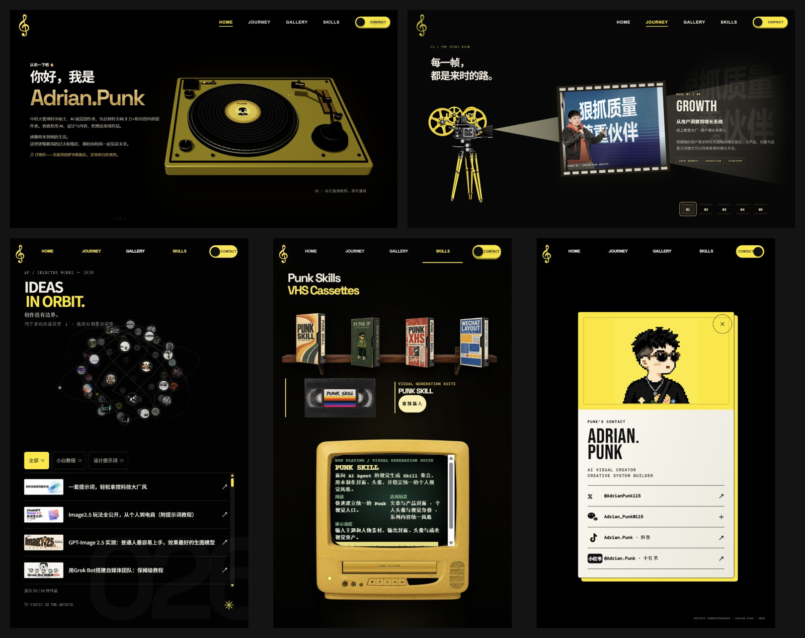

# 011 · Adrian.Punk：个人主页的五类内容与物件故事

[返回总索引](../../README.md) · [个人主页](https://iamadrianpunk.com/) · [作者产品仓库](https://github.com/adrianpunk)

## 网页总结与下一步规划

新增 [故事开场效果展台](app/openings.html)：点亮工作台、拆开一封信、连接探索星图三种可重播演示；附六个创意开头与后续故事映射。[效果、素材与生成提示词](notes/openings.md)。

[打开网页源码入口](app/index.html) · [运行与检查说明](notes/web.md)

页面直接展示最开始分析的五页汇总引导图，解释五类内容与物件的映射、故事如何承接、整体风格如何统一，并给出从真实材料到个人主页的四步计划。创作工具产品思路保留为补充研究。

## 本次理解摘要

以**人物介绍、经历介绍、文章介绍、产品介绍、联系方式**实现个人主页，分别配合**唱片、放映机、轨道星球、磁带与电视机、书信**形成故事效果。开头通过物件与动作吸引注意，再由一段故事引出下一段故事；统一风格使五个板块属于同一个人物世界。

**核心需要自己完成的是故事构造。** 先整理真实资料、经历与成果，提炼人物主线，再选择与内容有关联的物件，编排动作和信息出现的顺序。

| 内容 | 原站物件 | 故事作用 |
| --- | --- | --- |
| 人物介绍 | 唱片 / 唱机 | 开始聆听、认识人物与气质 |
| 经历介绍 | 放映机 / 胶片 | 回看关键片段，理解经历与能力 |
| 文章介绍 | 轨道星球 / 目录 | 探索思考与观点组成的内容世界 |
| 产品介绍 | 磁带 + 电视机 | 选择产品，展示用途和成果入口 |
| 联系方式 | 书信 / 信封与名片 | 从了解作者过渡到建立联系 |

轨道体现内容的视觉关联感；未验证每条轨道编码了真实文章关系。引导图使用最开始分析的五页汇总图，保留原图内容。

下一步：五类真实材料 → 一句话主线与五段提纲 → 内容—物件—动作映射 → 完整个人主页。三个开场演示提供效果参考，文案尚未替换为个人事实。

## 补充研究结论

**展示层：人物介绍、经历介绍、文章介绍、产品介绍、联系方式，是内容骨架；人物主线组织这些内容，相关物件承载信息，交互让访客逐步理解。**

**产品层：把创作者反复遇到的视觉与发布工作，拆成有明确输入、输出和使用场景的小工具。** 文章解释方法、提供案例，工具帮助复用，主页集中展示作者与成果。这是根据公开产品和入口形成的分析，不代表已核实其创业过程或经营收益。

**对我们：核心仍是根据真实材料构造自己的故事，再学习物件关联、交互编排与整体风格。** 本次未确认新增底层技术能力，未安装或运行其 Agent Skills；目前完成产品思路研究和展示方法归档。

## 阅读入口

| 文档 | 内容 |
| --- | --- |
| [已分析能力整理](notes/capabilities.md) | 五类内容、四层设计顺序、八项能力、交互映射和复用表 |
| [产品思路拆解](notes/product-thinking.md) | 四项主产品、相互关系、产品化机制、技术和商业边界 |
| [我们的参考价值](notes/reference-value.md) | 与现有研究的关联、优先验证的方向、最小产品定义卡 |
| [主页观察记录](notes/homepage-observations.md) | 前轮五板块截图、实际操作与限制 |
| [来源与验证范围](notes/sources.md) | 公开来源、日期、观察/自述/推断分层 |

## 主页结构总览

图为前轮实际截图汇总，包含宽、窄两种浏览器画面；不是完整响应式测试。

## 产品地图

| 环节 | 产品 | 用户获得的结果 |
| --- | --- | --- |
| 内容入口视觉 | [Punk Skill](https://github.com/adrianpunk/Punk-Skill) | 封面、头像 |
| 持续人物表达 | [IP Illustrations](https://github.com/adrianpunk/punk-ip-illustrations) | 可复用角色与文章场景插图 |
| 长文跨平台改编 | [XHS Cards](https://github.com/adrianpunk/punk-xhs-cards) | 竖版知识卡片与发布素材 |
| 长文排版 | [Punk微排](https://weipai.iamadrianpunk.com/) | 可预览、复制到公众号编辑器的排版内容 |

这是围绕同类用户的任务组合。已核实 XHS Cards 文档明确依赖 IP Illustrations；未验证四项产品已自动串成一条流水线。

## 研究信息

| 项目 | 内容 |
| --- | --- |
| 状态 / 日期 | 已总结 / 2026-09-15 |
| 研究类型 | 设计方法与产品思路研究 |
| 证据 | 前轮主页截图，本轮产品说明、公开 README、微排工作区 |
| 源码与性能 | 未全面审查；未进行生成质量和效率对照 |
| 实现 / 发布 | 已增加静态总结与规划页，接入研究站本地构建；尚未部署本次更新 |
| 许可 | 多个当前产品明确采用个人非商用免费、商业付费授权；网站素材许可未确认 |

补充研究方向：用已有一篇研究笔记，试做一次“结构化研究卡 → 展示图 → 对外阅读稿”，记录人工修改点后再确定应封装哪一项能力。
