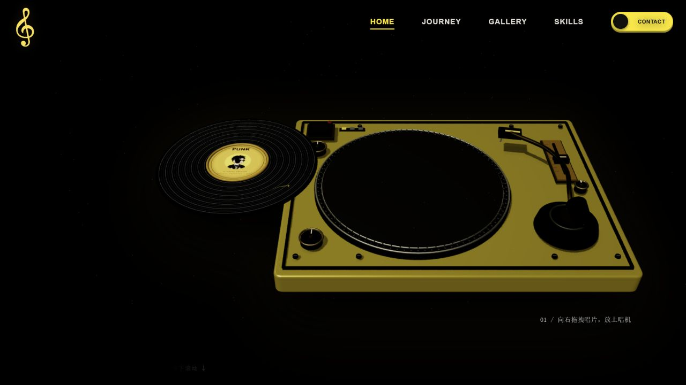
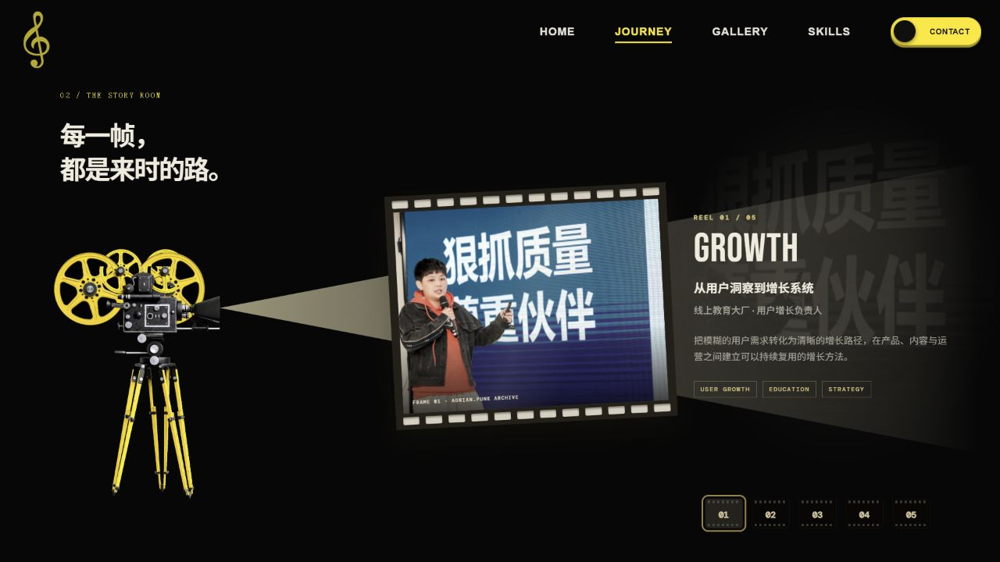
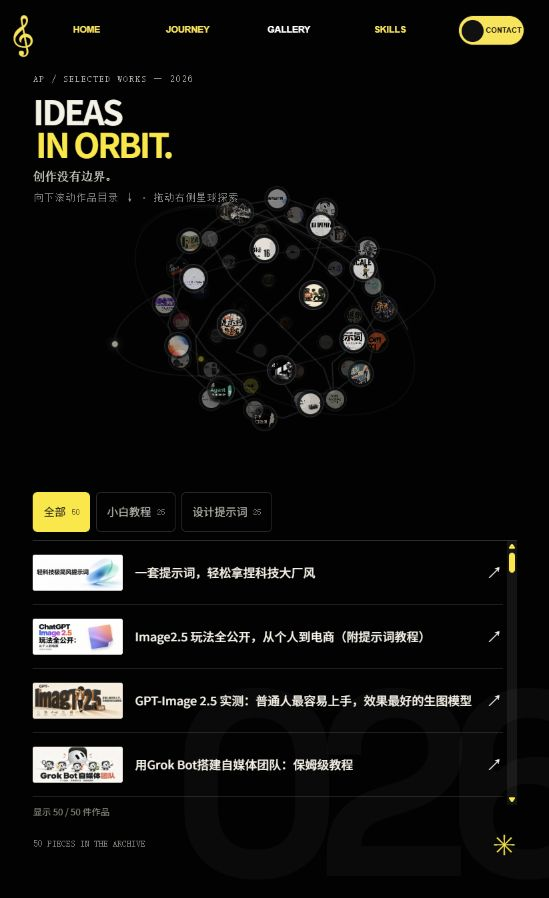
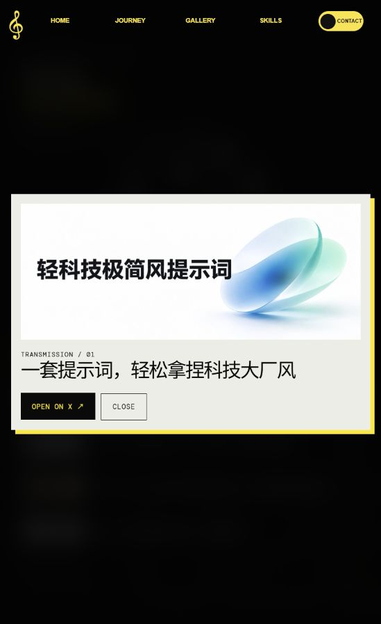
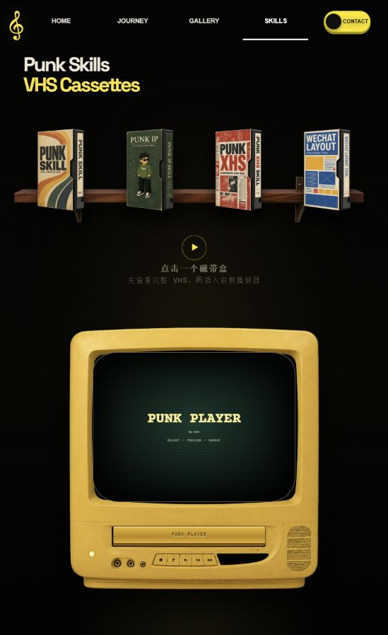
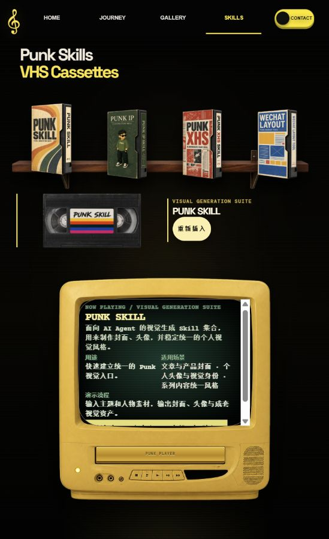
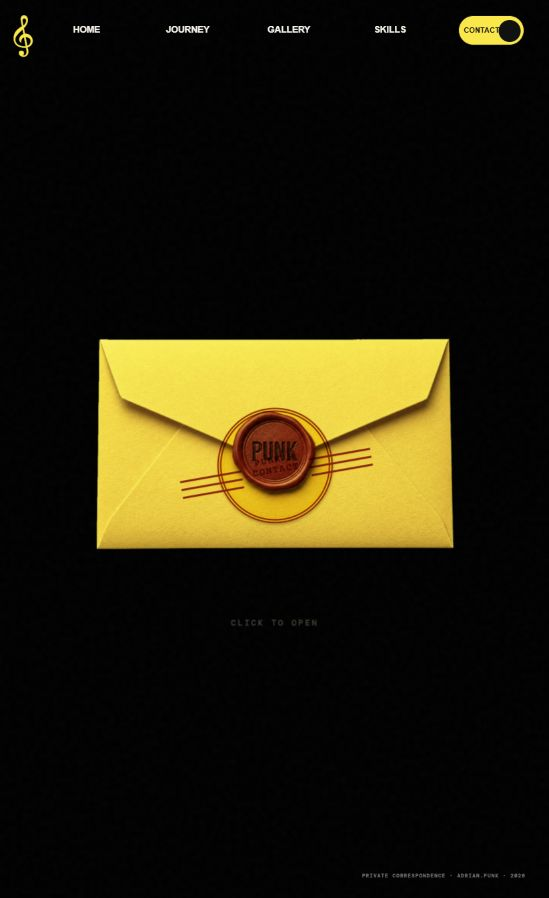
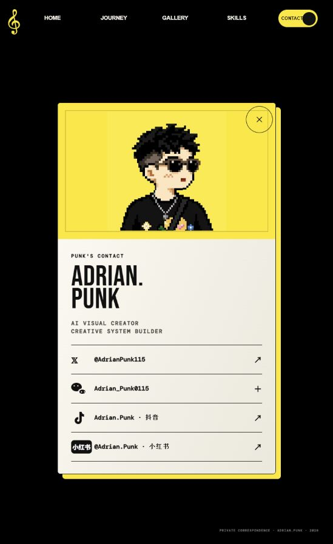

# Adrian.Punk 个人主页梳理

[返回项目入口](../README.md)

本文件为前轮观察记录，截图已归入本子项目 assets；本轮产品研究见 [产品思路](product-thinking.md)。

来源：https://iamadrianpunk.com/#home  
查看日期：2026-09-15。依据本次页面截图、可访问性树与实际操作；个人履历、粉丝数、项目描述均为站点自述。

## 核心判断

这是一个以复古媒介和个人创作身份串联起来的互动展厅。内容主线为：认识我 → 理解我的经历 → 看我的作品 → 使用我的工具 → 与我联系。

## 1. HOME：通过唱片认识作者

黑底、黄色唱机、音乐符号和大字号姓名共同建立视觉识别。自述身份包括中科大管理科学硕士、AI 视觉创作者、内容创作者，并强调配乐为作者本人演奏的萨克斯。

实际完成唱片向右拖入，随后出现自我介绍和第二步落针提示。唱臂拖动及一次 Enter 尝试未观察到状态变化；本次没有验证音频实际播放，不能据此断定音频故障。

评价：记忆点强；小字操作提示和向下滚动提示偏暗。建议提供更清楚的操作提示和直接播放入口。

## 2. JOURNEY：以放映机组织个人经历

五段经历均完成按钮切换：用户增长、疫苗研发质量管理、中科大管理科学、AI 视觉与内容创作、FDE 与企业 AI 培训。每段用照片、身份、一句能力总结和简短说明组织内容。

评价：切换正常，叙事清楚。把不同职业经历提炼为可迁移能力，是内容上最值得学习的部分。底部数字胶片缺少直观的主题名称，需要逐个探索。

## 3. GALLERY：作品星球与文字目录并行

页面显示 50 件作品，分类为 25 个小白教程和 25 个设计提示词。星球负责视觉探索，目录负责按标题查找。打开首件作品后，出现大图、标题和 OPEN ON X 外链；关闭成功。未逐一检查 50 件作品，也未验证分类筛选和星球拖动。

评价：同时照顾探索与查找，是可复用的结构。内容集中在教程、提示词和工作流，站点承担内容索引与社交平台导流角色。详情外跳会增加阅读中断。

## 4. SKILLS：把工具做成可插入的 VHS 磁带

四个入口分别为 PUNK SKILL、IP ILLUSTRATIONS、XHS CARDS、WECHAT LAYOUT。完成第一盒磁带的选择、预览、插入；电视显示工具说明、用途、适用场景、演示流程和 GitHub 入口。

评价：物件和操作的对应关系完整，工具变得具体且容易记忆。窄屏截图中，说明被限制在电视屏幕内，出现内嵌滚动条，文字较密。建议在电视外增加可展开的完整说明和直接访问按钮。

## 5. CONTACT：拆信封获得联系名片

黄色火漆信封点击后展开名片，包含像素头像、个人定位，以及 X、微信、抖音、小红书入口。未对外发送消息，未验证外链和二维码展开。

评价：展开正常，完成了统一的物件叙事。联系方式多一步操作才能看到，适合重体验的个人品牌站；如强调合作转化，可补充更明确的合作方向或直接联系入口。

## 视觉与交互方法

- 黑色提供舞台感，黄色贯穿物件、标题、导航和按钮，米白用于文字与卡片。
- 唱片、胶片、VHS 和信封组成复古媒介系列；轨道星球和像素头像补充 AI 创作者气质。
- 大标题负责识别，小型编号、英文标签、纸张与设备纹理负责营造收藏档案感。
- 每一页选择一个主要物件，每一个操作承载一层信息。固定导航提供跨板块直达入口。
- 网站本身也在展示作者的视觉表达和工作流组织能力。

## 值得优先改善的部分

1. 提高关键操作提示的字号和对比度，尤其是首页、磁带区和信封提示。
2. 将技能长说明移出小电视窗口，减少内嵌滚动。
3. 为拖拽、插带等交互提供清晰的直接操作入口，并复查键盘响应与焦点。
4. 若目标是商业合作，增加具体服务、成果案例和明确的联系理由。

## 检查边界

本次观察覆盖五个主板块及代表性交互。浏览器过程中返回了宽、窄两种画面；未执行完整的移动设备适配测试。未测量加载性能、颜色对比值，未检查源码、技术栈、读屏器、减少动态效果设置或所有键盘路径。截图中偏暗文字属于可见风险，不等同于已确认违反某项无障碍标准。
