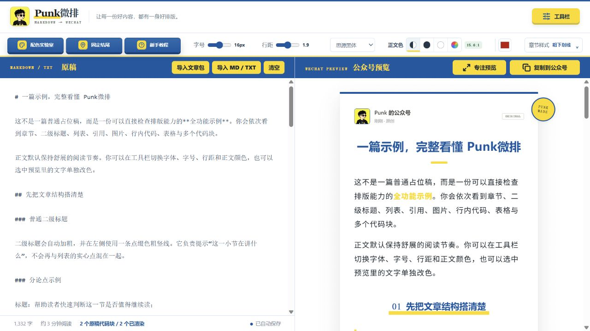

# 产品思路：把创作中的重复工作变成可使用的成果

[返回项目入口](../README.md) · [来源与边界](sources.md)

## 一、两层产品

**个人主页是一项展示产品。** 它集中人物、经历、文章、工具和联系信息，用一致设计建立识别，用成果让访客理解能力。

**主页里的工具是任务产品。** 每项围绕一类具体工作定义输入和输出，让用户获得封面、配图、卡片或排版结果。

对我们的参考价值分别是：如何呈现已有能力，以及如何让已有能力被别人重复使用。

## 二、四项主产品

Skill 能力来自作者公开说明，未在本地运行；微排已打开并观察默认示例和工作区。

| 产品 / 形态 | 主要用户问题 | 输入 → 输出 | 核实程度 |
| --- | --- | --- | --- |
| [Punk Skill](https://github.com/adrianpunk/Punk-Skill) / Agent Skills | 封面与头像每次重新描述风格 | 文章或主题、照片与偏好 → 封面或头像 | README 已读，未运行 |
| [IP Illustrations](https://github.com/adrianpunk/punk-ip-illustrations) / Agent Skill | 多篇文章的人物形象难以持续一致 | 人物照片、确认角色、文章 → 角色资产和场景插图 | README 与主页已核对，未生成 |
| [XHS Cards](https://github.com/adrianpunk/punk-xhs-cards) / Skill 与渲染脚本 | 长文改为卡片需要重新拆分和排版 | 人物资料、Markdown 与图片 → 竖版卡片及发布素材 | README 与主页已核对，未运行 |
| [Punk微排](https://weipai.iamadrianpunk.com/) / 网页工具 | Markdown 进入公众号前需要整理格式 | Markdown、TXT 或文章包 → 可预览排版内容 | 已看示例，未验证微信粘贴效果 |

### Punk Skill：围绕结果组织风格经验

公开入口分为封面与头像两类任务，用户以内容和偏好发起请求。它将视觉决策整理为可复用指导，并依赖宿主图像能力完成生成；不能等同于自研生图模型。来源：[产品说明](https://github.com/adrianpunk/Punk-Skill)。

### IP Illustrations：让角色成为长期资产

文档描述先生成角色设定和参考资产，经确认后用于多篇文章。设计价值是把一次性结果延伸为可反复调用的素材；角色一致性仍需生成测试。来源：[产品说明](https://github.com/adrianpunk/punk-ip-illustrations)。

### XHS Cards：改变一篇文章的阅读形式

文档涵盖人物与样式确认、正文解析、必要图片保留、卡片渲染及发布素材，并明确依赖 IP Illustrations 生成主题插图。重点是把跨平台内容复用做成完整任务。来源：[产品说明](https://github.com/adrianpunk/punk-xhs-cards)。

### Punk微排：用直接操作降低使用门槛

已观察原稿与公众号预览并排显示，提供字号、行距、颜色、章节样式和复制入口。它适合边看边调整；页面提示复制后粘贴到公众号编辑器，不能据此宣称自动代发文章。来源：[产品页面](https://weipai.iamadrianpunk.com/)。

## 三、产品之间的关系

可按工作组织为：**形成文章 → 准备入口视觉与人物配图 → 按平台整理阅读形式 → 预览与交付。**

这些是相邻任务，未必严格按顺序全部使用，可以服务同一篇文章和同一位创作者。

- **已说明的依赖**：XHS Cards 的主题插图环节依赖 IP Illustrations。
- **我们的关系分析**：四项工具围绕内容创作与分发相互补充；尚未验证共享账户、统一角色格式或自动接力机制。

## 四、可以提炼的产品化方法

以下是分析模型，不是作者创业顺序的事实记录。

1. **选具体且反复发生的问题。** 做封面、统一角色、拆长文、排版，都容易让用户判断是否需要。
2. **明确可交付结果。** 说明用户最终拿到什么，而不是只列模型或自动化等技术词。
3. **把经验拆成规则。** 内容怎样表达、哪些元素必须保留、哪些判断需要用户决定。
4. **保存稳定资料。** 人物形象、主题色和格式偏好减少重复输入。
5. **匹配实现方式。** 内容理解与生成可交给模型；尺寸、分页和输出检查可由程序承担；频繁调整的参数适合可见界面。
6. **补全交付。** 文件、说明、示例、入口和必要检查共同减少用户的后续拼装工作。

具体源码是否完整实现约束、失败怎样恢复，需后续代码与运行验证。

## 五、文章、工具与主页互相支持

一种合理解释是：**文章展示方法和效果 → 工具供读者尝试复用 → 主页集中呈现成果与作者 → 联系渠道承接反馈与合作。**

依据包括主页文章外链、工具入口、名片和企业培训自述。没有可验证漏斗数据，不能据此判断转化率、收入或客户规模。

参考价值在于：同一个问题可以沉淀为文章、案例和工具三个层次的成果，彼此解释和验证。

## 六、补充产品和授权模式

[REDSkill Forge](https://github.com/adrianpunk/Punk-REDSkill-Forge) 将已有 Skill 整理为提交包与检查材料，属于交付环节延伸；文档明确不保证审核通过、不代为发布。[Visual Imprint](https://github.com/adrianpunk/visual-imprint-skill) 也描述照片到角色和配图的流程，本次不作为已确认独立的新能力重复计数。

当前多个仓库声明个人非商用免费、商业使用需要付费书面授权。可确认授权入口存在，不能确认实际收入。我们学习通用产品方法；后续引入具体代码、规则文件或品牌素材时，需按所用版本核对许可。

## 七、阶段判断

- 参考价值高：任务选择、输入输出定义、经验整理、资产复用、完整交付和展示组织。
- 需要实测：角色一致性、文章保真、卡片可读性、微信粘贴兼容性、生成成本与节省时间。
- 尚未确认：新模型、新渲染引擎、可直接复用的主页源码和已验证商业收益。
